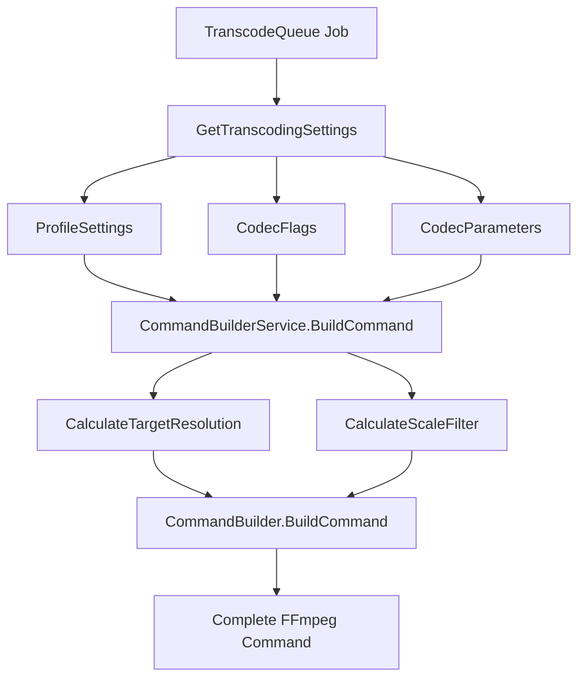

# Transcode Command Logic

This document provides a comprehensive overview of the complex transcoding command building logic in MediaVortex. The command building system is responsible for constructing FFmpeg commands based on user profiles, codec settings, and resolution requirements.

## Overview

The transcoding command logic follows the MVVM pattern with clear separation of concerns:
- **Models**: Pure data transformation (`CommandBuilder`)
- **Services**: Business logic orchestration (`CommandBuilderService`, `ResolutionService`)
- **Controllers**: High-level coordination (`ProcessTranscodeQueueService`)

## Architecture Components

### 1. Command Building Flow



### 2. Key Components

#### CommandBuilderService
**File**: `Services/CommandBuilderService.py`
- **Purpose**: Orchestrates command building by coordinating data retrieval and command construction
- **Key Methods**:
  - `BuildCommand()`: Main orchestration method
  - `CalculateTargetResolution()`: Determines target resolution from profile settings
  - `CalculateScaleFilter()`: Generates FFmpeg scale filter for resolution changes

#### CommandBuilder (Model)
**File**: `Models/CommandBuilder.py`
- **Purpose**: Pure data transformation model for building FFmpeg commands
- **Key Methods**:
  - `BuildCommand()`: Constructs complete FFmpeg command string
  - `_BuildVideoFilters()`: Builds video filter chain
  - `_GenerateOutputFileName()`: Creates output filename with resolution

#### ResolutionService
**File**: `Services/ResolutionService.py`
- **Purpose**: Handles resolution standardization and scaling logic
- **Key Methods**:
  - `StandardizeResolution()`: Converts any resolution format to standard format
  - `GetStandardHeight()`: Maps resolution to standard height
  - `CalculateStandardWidth()`: Maintains aspect ratio during scaling

## Data Flow

### 1. Settings Retrieval

The command building process begins with retrieving transcoding settings:

```python
def GetTranscodingSettings(self, Job: TranscodeQueueModel, MediaFile: MediaFileModel) -> Optional[Dict[str, Any]]:
    # Get profile settings for target resolution
    ProfileSettings = self.DatabaseManager.GetProfileSettingsForTargetResolution(
        MediaFile.AssignedProfile, MediaFile.Resolution
    )
    
    # Get codec flags
    CodecFlags = self.DatabaseManager.GetCodecFlagsByCodecName(ProfileSettings.get('Codec'))
    
    # Get codec parameters
    CodecParameters = self.DatabaseManager.GetCodecParametersByCodecFlagsId(CodecFlags['Id'])
    
    return {
        'ProfileSettings': ProfileSettings,
        'CodecFlags': CodecFlags,
        'CodecParameters': CodecParameters,
        'SourceResolution': MediaFile.Resolution
    }
```

### 2. Resolution Processing

#### TranscodeDownTo Logic
The system uses a sophisticated resolution processing logic:

**TranscodeDownTo** (Database Field):
- **Source**: User setting from UI in ProfileThresholds table
- **Values**: "720p", "1080p", "No downscaling", etc.
- **Purpose**: Raw user preference for transcoding behavior

**TargetResolution** (Calculated Field):
- **Source**: Processed result from TranscodeDownTo logic
- **Values**: Actual resolution to transcode to (e.g., "720p", "1080p")
- **Purpose**: Final resolution used in FFmpeg command

**Processing Logic**:
- `TranscodeDownTo = "720p"` → `TargetResolution = "720p"`
- `TranscodeDownTo = "No downscaling"` → `TargetResolution = SourceResolution`
- `TranscodeDownTo = "1080p"` → `TargetResolution = "1080p"`

#### Resolution Standardization
The ResolutionService standardizes various resolution formats:

```python
def StandardizeResolution(self, Resolution: str) -> str:
    # Handle pixel format (e.g., '1920x1080')
    if 'x' in Resolution:
        Width, Height = self.ParseResolution(Resolution)
        StandardHeight = self.GetStandardHeight(Height)
        StandardWidth = self.CalculateStandardWidth(Width, Height, StandardHeight)
        return self.MapToStandardResolution(StandardWidth, StandardHeight)
    
    # Handle standard format (e.g., '1080p')
    if Resolution.endswith('p'):
        return Resolution  # Already standard
    
    return "480p"  # Default fallback
```

### 3. Command Construction

#### Basic Command Structure
FFmpeg commands follow this structure:
```
ffmpeg -i input [options] output -y
```

#### Command Building Process
```python
def BuildCommand(self, CommandData: Dict[str, Any]) -> Optional[str]:
    # Extract data
    Job = CommandData.get('Job')
    MediaFile = CommandData.get('MediaFile')
    ProfileSettings = CommandData.get('ProfileSettings', {})
    
    # Build command components
    InputPath = f"C:/MediaVortex/Source/{MediaFile.FileName}"
    OutputFileName = self._GenerateOutputFileName(MediaFile.FileName, SourceResolution, TargetResolution)
    OutputPath = f"C:/MediaVortex/{OutputFileName}"
    
    # Start building command
    CommandParts = ['FFmpegMaster\\bin\\ffmpeg.exe', '-i', f'"{InputPath}"']
    
    # Add video codec
    VideoCodec = ProfileSettings.get('Codec', 'libsvtav1')
    CommandParts.extend(['-c:v', VideoCodec])
    
    # Add other parameters...
    
    return ' '.join(CommandParts)
```

## Parameter Processing

### 1. Video Codec Parameters

#### Codec Selection
The system supports multiple video codecs:
- **libsvtav1**: AV1 codec (default)
- **libx265**: H.265/HEVC codec
- **libx264**: H.264 codec
- **libvpx-vp9**: VP9 codec

#### Preset Handling
Presets control encoding speed vs. quality trade-offs:

```python
# Add preset if specified - only if not null/blank
Preset = ProfileSettings.get('Preset')
if Preset is not None and Preset != '' and Preset != 'None':
    CommandParts.extend(['-preset', str(Preset)])
```

**Codec-Specific Preset Ranges**:
- **libsvtav1**: -2 to 13 (default: -2)
- **libx265**: 0 to 9 (default: 6)
- **libx264**: 0 to 9 (default: 6)

#### Quality Control
Quality is controlled via CRF (Constant Rate Factor):

```python
# Add CRF/Quality if specified - only if not null/blank
Quality = ProfileSettings.get('Quality')
if Quality is not None and Quality != '' and Quality != 'None':
    CommandParts.extend(['-crf', str(Quality)])
```

**CRF Ranges**:
- **libsvtav1**: 0-63 (lower = better quality)
- **libx265**: 0-51 (lower = better quality)
- **libx264**: 0-51 (lower = better quality)

#### Bitrate Control
Maximum bitrate can be set to control file size:

```python
# Add video bitrate control (maxrate) - only if not null/blank
VideoBitrate = ProfileSettings.get('VideoBitrateKbps')
if VideoBitrate and VideoBitrate != '' and VideoBitrate != 'None':
    CommandParts.extend(['-maxrate', f'{VideoBitrate}k'])
```

#### Film Grain
Film grain simulation for better quality:

```python
# Add film grain if specified (for libsvtav1) - only if not null/blank and > 0
FilmGrain = ProfileSettings.get('Grain')
if FilmGrain is not None and FilmGrain != '' and FilmGrain != 'None' and FilmGrain > 0:
    CommandParts.extend(['-svtav1-params', f'film-grain={FilmGrain}'])
```

**Codec-Specific Grain Handling**:
- **libsvtav1**: Numeric parameter (0-50)
- **libx265**: Boolean tune parameter (`-tune grain`)
- **libx264**: Boolean tune parameter (`-tune film`)

### 2. Video Filters

#### Deinterlacing
YADIF (Yet Another Deinterlacing Filter) for interlaced content:

```python
def _BuildVideoFilters(self, ProfileSettings: Dict[str, Any], ScaleFilter: Optional[str]) -> Optional[str]:
    Filters = []
    
    # Add deinterlacing filter if specified
    YadifMode = ProfileSettings.get('YadifMode')
    YadifParity = ProfileSettings.get('YadifParity')
    YadifDeint = ProfileSettings.get('YadifDeint')
    
    if (YadifMode is not None and YadifMode != '' and YadifMode != 'None' and
        YadifParity is not None and YadifParity != '' and YadifParity != 'None' and
        YadifDeint is not None and YadifDeint != '' and YadifDeint != 'None'):
        YadifFilter = f"yadif=mode={YadifMode}:parity={YadifParity}:deint={YadifDeint}"
        Filters.append(YadifFilter)
    
    # Add scale filter if provided
    if ScaleFilter:
        Filters.append(ScaleFilter)
    
    return ','.join(Filters) if Filters else None
```

#### Resolution Scaling
Scale filter for resolution changes:

```python
def CalculateScaleFilter(self, SourceResolution: str, TargetResolution: str) -> Optional[str]:
    # If resolutions are the same, no scaling needed
    if SourceResolution == TargetResolution:
        return None
    
    # Calculate target dimensions maintaining 16:9 aspect ratio
    TargetWidth = self._CalculateWidthFromHeight(StandardTargetHeight)
    ScaleFilter = f"scale={TargetWidth}:{StandardTargetHeight}"
    
    return ScaleFilter
```

**Standard Resolution Dimensions**:
- **2160p (4K)**: 3840x2160
- **1080p (Full HD)**: 1920x1080
- **720p (HD)**: 1280x720
- **480p (SD)**: 854x480

### 3. Audio Processing

#### Audio Codec and Bitrate
```python
# Add audio codec and bitrate - only if not null/blank
AudioBitrate = ProfileSettings.get('AudioBitrateKbps')
if AudioBitrate and AudioBitrate != '' and AudioBitrate != 'None':
    CommandParts.extend(['-c:a', 'aac', '-b:a', f'{AudioBitrate}k'])
else:
    CommandParts.extend(['-c:a', 'copy'])
```

**Audio Options**:
- **Transcode**: AAC codec with specified bitrate
- **Copy**: Copy original audio stream (faster, no quality loss)

## File Path Management

### 1. Input Paths
Source files are copied to a standardized location:
```
C:/MediaVortex/Source/{MediaFile.FileName}
```

### 2. Output Paths
Transcoded files are saved to:
```
C:/MediaVortex/{OutputFileName}
```

### 3. Filename Generation
Output filenames are modified to reflect target resolution:

```python
def _GenerateOutputFileName(self, OriginalFileName: str, SourceResolution: str, TargetResolution: str) -> str:
    # If resolutions are the same, use original filename
    if SourceResolution == TargetResolution:
        return OriginalFileName
    
    # Extract resolution from filename (e.g., "1080p", "720p")
    SourceResolutionStr = self._ExtractResolutionFromFilename(OriginalFileName)
    if not SourceResolutionStr:
        return OriginalFileName
    
    # Replace source resolution with target resolution
    TargetResolutionStr = self._FormatResolutionForFilename(TargetResolution)
    NewFileName = OriginalFileName.replace(SourceResolutionStr, TargetResolutionStr)
    
    return NewFileName
```

**Resolution Pattern Matching**:
- `\b2160p\b` - 4K resolution
- `\b1080p\b` - Full HD resolution
- `\b720p\b` - HD resolution
- `\b480p\b` - SD resolution
- `\b4K\b` - 4K alternative
- `\bHD\b` - HD alternative
- `\bSD\b` - SD alternative

## Codec Configuration

### 1. CodecFlags Model
**File**: `Models/CodecFlagsModel.py`

The CodecFlags model defines codec-specific parameters:

```python
@dataclass
class CodecFlagsModel:
    Id: Optional[int] = None
    CodecName: str = ""  # e.g., "libx265", "libsvtav1"
    DisplayName: str = ""  # e.g., "H.265 (libx265)", "AV1 (libsvtav1)"
    PresetType: str = "numeric"  # "string" or "numeric"
    PresetMin: int = 0
    PresetMax: int = 13
    PresetDefault: int = 6
    FilmGrainType: str = "numeric"  # "boolean" or "numeric"
    FilmGrainMin: int = 0
    FilmGrainMax: int = 50
    FilmGrainDefault: int = 10
```

### 2. CodecParameters Model
**File**: `Models/CodecParametersModel.py`

Individual codec parameters with validation:

```python
@dataclass
class CodecParametersModel:
    Id: Optional[int] = None
    CodecFlagsId: int = 0
    ParameterName: str = ""  # e.g., "crf", "preset", "film-grain"
    ParameterType: str = ""  # "integer", "float", "string", "boolean"
    MinValue: Optional[float] = None
    MaxValue: Optional[float] = None
    DefaultValue: str = ""
    Description: str = ""
    FFmpegFlag: str = ""  # e.g., "-crf", "-svtav1-params film-grain"
```

### 3. Parameter Validation
The system includes comprehensive parameter validation:

```python
def IsValueValid(self, value: Any) -> bool:
    if self.ParameterType == "integer":
        int_value = int(value)
        if self.MinValue is not None and int_value < self.MinValue:
            return False
        if self.MaxValue is not None and int_value > self.MaxValue:
            return False
        return True
    elif self.ParameterType == "float":
        float_value = float(value)
        if self.MinValue is not None and float_value < self.MinValue:
            return False
        if self.MaxValue is not None and float_value > self.MaxValue:
            return False
        return True
    # ... other types
```

## Error Handling

### 1. Validation Errors
- **Missing Data**: Returns None if required data is missing
- **Invalid Parameters**: Uses default values for invalid parameters
- **File Path Issues**: Handles path generation errors gracefully

### 2. Fallback Mechanisms
- **Default Codec**: Falls back to libsvtav1 if no codec specified
- **Default Resolution**: Falls back to 480p for invalid resolutions
- **Default Quality**: Uses codec-specific default values

### 3. Logging
Comprehensive logging throughout the command building process:
- **Function Entry**: Logs when functions are called
- **Parameter Values**: Logs parameter values being used
- **Command Construction**: Logs command building steps
- **Error Conditions**: Logs errors and fallback actions

## Example Commands

### 1. Basic AV1 Transcoding
```bash
FFmpegMaster\bin\ffmpeg.exe -i "C:/MediaVortex/Source/movie.mkv" -c:v libsvtav1 -preset 6 -crf 28 -c:a copy -y "C:/MediaVortex/movie.mkv"
```

### 2. Resolution Scaling with Deinterlacing
```bash
FFmpegMaster\bin\ffmpeg.exe -i "C:/MediaVortex/Source/movie_1080p.mkv" -c:v libsvtav1 -preset 6 -crf 28 -vf "yadif=mode=1:parity=auto:deint=1,scale=1280:720" -c:a aac -b:a 128k -y "C:/MediaVortex/movie_720p.mkv"
```

### 3. High Quality with Film Grain
```bash
FFmpegMaster\bin\ffmpeg.exe -i "C:/MediaVortex/Source/movie.mkv" -c:v libsvtav1 -preset 4 -crf 20 -svtav1-params film-grain=15 -maxrate 8000k -c:a aac -b:a 256k -y "C:/MediaVortex/movie.mkv"
```

## Performance Considerations

### 1. Command Optimization
- **Parameter Validation**: Prevents invalid commands from being executed
- **Efficient Filtering**: Only adds filters when necessary
- **Path Optimization**: Uses relative paths where possible

### 2. Memory Management
- **Pure Functions**: CommandBuilder model has no side effects
- **Data Transformation**: Minimal memory footprint for command building
- **Cleanup**: Proper cleanup of temporary data structures

### 3. Scalability
- **Modular Design**: Easy to add new codecs and parameters
- **Configuration-Driven**: Codec settings stored in database
- **Extensible**: New filter types can be added easily

## Future Enhancements

### 1. Advanced Codec Support
- **Hardware Acceleration**: Support for NVENC, QuickSync, VAAPI
- **New Codecs**: Support for emerging codecs like AV2
- **Codec-Specific Optimizations**: Tuned parameters for specific use cases

### 2. Intelligent Parameter Selection
- **Content Analysis**: Automatic parameter selection based on content type
- **Quality Prediction**: Estimate output quality before transcoding
- **Performance Optimization**: Automatic preset selection based on hardware

### 3. Advanced Filtering
- **AI-Enhanced Upscaling**: Support for AI-based upscaling filters
- **Noise Reduction**: Advanced noise reduction options
- **Color Grading**: Basic color correction and grading options

This command logic system provides a robust, flexible foundation for video transcoding with comprehensive parameter support, error handling, and extensibility for future enhancements.
