# Entity Relationship Diagram

Auto-generated by `Scripts/GenerateERD.py` from the PostgreSQL database.
Renderable in GitHub, VS Code (with Mermaid extension), or [mermaid.live](https://mermaid.live).

```mermaid
erDiagram

    %% Inferred Relationships (no FK constraint)
    codecflags ||..o{ codecparameters : "codecflagsid"
    seasons ||..o{ mediafiles : "seasonid"
    seasons ||..o{ mediafilesarchive : "seasonid"
    transcodeattempts ||..o{ mediafilesarchive : "transcodeattemptid"
    codecflags ||..o{ presetoptions : "codecflagsid"
    codecflags ||..o{ profiles : "codecflagsid"
    profiles ||..o{ profilethresholds : "profileid"
    transcodeattempts ||..o{ qualitytestingqueue : "transcodeattemptid"
    transcodeattempts ||..o{ qualitytestingqueuebackup : "transcodeattemptid"
    transcodeattempts ||..o{ qualitytestingqueuetest : "transcodeattemptid"
    profiles ||..o{ qualitytestingstrategies : "profileid"
    transcodeattempts ||..o{ qualitytestprogress : "transcodeattemptid"
    transcodeattempts ||..o{ qualitytestresults : "transcodeattemptid"
    rootfolders ||..o{ seasons : "rootfolderid"
    transcodeattempts ||..o{ temporaryfilepaths : "transcodeattemptid"
    transcodeattempts ||..o{ transcodeprogress : "transcodeattemptid"

    activejobs {
        bigint id PK
        text servicename
        text jobtype
        bigint queueid
        bigint processid
        bigint threadid
        timestamp startedat
        text status
        timestamp createdat
        timestamp updatedat
    }

    codecflags {
        bigint id PK
        text codecname
        text displayname
        text presettype
        bigint presetmin
        bigint presetmax
        bigint presetdefault
        text presetoptions
        text filmgraintype
        bigint filmgrainmin
        bigint filmgrainmax
        bigint filmgraindefault
        text tuneoptions
        timestamp createddate
        timestamp lastmodified
    }

    codecparameters {
        bigint id PK
        bigint codecflagsid FK
        text parametername
        text parametertype
        double minvalue
        double maxvalue
        text defaultvalue
        text description
        text ffmpegflag
        timestamp createddate
    }

    compliantfiles {
        bigint id PK
        text filepath
        text filename
        text directory
        bigint sizebytes
        double sizemb
        text reason
        timestamp dateadded
        timestamp lastmodified
    }

    compressionlearningmodels {
        bigint id PK
        text modelname
        text modelversion
        text modeltype
        text modeldata
        bigint trainingsamples
        double accuracy
        timestamp createddate
        timestamp lasttrained
        bool isactive
    }

    compressionlearningsamples {
        bigint id PK
        text filepath
        text filename
        text directory
        bigint sizebytes
        double sizemb
        text resolution
        text videocodec
        text audiocodec
        text contenttype
        bigint currentbitrate
        bigint quality
        bigint originalsizebytes
        bigint compressedsizebytes
        bigint sizereductionbytes
        double sizereductionpercent
        double transcodedurationseconds
        bool success
        text errormessage
        timestamp dateadded
        text analysisfactors
    }

    compressionlearningstats {
        bigint id PK
        text contenttype
        text resolution
        text videocodec
        bigint quality
        bigint samplecount
        double averagereductionpercent
        double minreductionpercent
        double maxreductionpercent
        double standarddeviation
        double confidencescore
        timestamp lastupdated
    }

    configuration {
        text key PK
        text value
        text description
        timestamp updatedat
    }

    jellyfinoperations {
        text logfilename PK
        text operationtype
        text filepath
        text filename
        text videocodec
        text audiocodec
        text container
        text resolution
        text reason
        text logdate
        timestamp importedat
        text subtitlecodecs
        text transcodeactions
        text destresolution
        text destprofile
        text destlevel
        text destpixelformat
        text destformat
    }

    logs {
        bigint id PK
        timestamp timestamp
        text loglevel
        text functionname
        text message
        text sourcefile
        bigint sourceline
        text sourcefunction
        text exceptiontype
        text exceptionmessage
        text stacktrace
        text userid
        text sessionid
        text requestid
        text component
        text operation
        bigint durationms
        text additionaldata
        timestamp createdat
    }

    mediafiles {
        bigint id PK
        bigint seasonid FK
        text filepath
        text filename
        double sizemb
        bigint videobitratekbps
        bigint audiobitratekbps
        text resolution
        text codec
        double durationminutes
        double framerate
        timestamp lastscanneddate
        text compressionpotential
        text assignedprofile
        text isinterlaced
        text resolutioncategory
        timestamp filemodificationtime
        bool keepsource
        bigint totalframes
        text codecprofile
        text colorrange
        text fieldorder
        bigint hasbframes
        bigint refframes
        text pixelformat
        bigint level
        bigint audiochannels
        bigint audiosamplerate
        text audiosampleformat
        text audiochannellayout
        text containerformat
        bigint overallbitrate
        bool transcodedbymediavortex
        timestamp lastmodifieddate
        bigint filesize
        text audiocodec
        text subtitleformats
    }

    mediafilesarchive {
        bigint id
        bigint seasonid FK
        text filepath
        text filename
        double sizemb
        bigint videobitratekbps
        bigint audiobitratekbps
        text resolution
        text codec
        double durationminutes
        double framerate
        timestamp lastscanneddate
        text compressionpotential
        text assignedprofile
        text isinterlaced
        text resolutioncategory
        timestamp filemodificationtime
        bool keepsource
        bigint totalframes
        text codecprofile
        text colorrange
        text fieldorder
        bigint hasbframes
        bigint refframes
        text pixelformat
        bigint level
        bigint audiochannels
        bigint audiosamplerate
        text audiosampleformat
        text audiochannellayout
        text containerformat
        bigint overallbitrate
        bool transcodedbymediavortex
        timestamp archivedate
        bigint transcodeattemptid FK
    }

    presetoptions {
        bigint id PK
        bigint codecflagsid FK
        text presetvalue
        text presetname
        text description
        bigint sortorder
        timestamp createddate
    }

    problemfiles {
        bigint id PK
        text filepath
        text filename
        text directory
        bigint sizebytes
        double sizemb
        text errortype
        text errormessage
        timestamp dateencountered
        bigint retrycount
        timestamp lastretry
    }

    profiles {
        bigint id PK
        text profilename
        text description
        timestamp createddate
        timestamp lastmodified
        text codec
        bigint preset
        bigint filmgrain
        bigint yadifmode
        bigint yadifparity
        bigint yadifdeint
        bigint codecflagsid FK
        bigint usenvidiahardware
    }

    profilethresholds {
        bigint id PK
        bigint profileid FK
        text resolution
        bigint under30minmb
        bigint under65minmb
        bigint over65minmb
        bigint videobitratekbps
        bigint audiobitratekbps
        bigint fallbackvideobitratekbps
        bigint fallbackaudiobitratekbps
        text transcodedownto
        bigint quality
        bool keepsource
        text containertype
    }

    qualitytestingqueue {
        bigint id PK
        bigint transcodeattemptid FK
        text originalfilepath
        text transcodedfilepath
        text localsourcepath
        timestamp dateadded
        timestamp datestarted
        timestamp datecompleted
    }

    qualitytestingqueuebackup {
        bigint id
        bigint transcodeattemptid FK
        text originalfilepath
        text transcodedfilepath
        text filename
        text status
        bigint priority
        text dateadded
        text datestarted
        text datecompleted
        text errormessage
        bigint retrycount
        bigint maxretries
        text strategytype
        bigint strategyid
        text alternativeprofileids
        text customsettings
        double vmafscore
        text createddate
        text completeddate
    }

    qualitytestingqueuetest {
        bigint id
        bigint transcodeattemptid FK
        text originalfilepath
        text transcodedfilepath
        text filename
        text status
        bigint priority
        text dateadded
        text datestarted
        text datecompleted
        text errormessage
        bigint retrycount
        bigint maxretries
        text strategytype
        bigint strategyid
        text alternativeprofileids
        text customsettings
        double vmafscore
        text createddate
        text completeddate
        text localsourcepath
    }

    qualitytestingstrategies {
        bigint id PK
        bigint profileid FK
        text strategytype
        double vmafthreshold
        bigint maxattempts
        text alternativeprofileids
        text customsettings
        bool isenabled
        timestamp createddate
        timestamp updateddate
    }

    qualitytestprogress {
        bigint id PK
        bigint transcodeattemptid FK
        text status
        bigint progresspercentage
        text currentstep
        bigint currentframe
        text currenttime
        text processingspeed
        text eta
        timestamp starttime
        timestamp updatedat
        timestamp createdat
    }

    qualitytestresults {
        bigint id PK
        bigint transcodeattemptid FK
        double testduration
        bool passesthreshold
        bigint rank
        text errormessage
        timestamp datetested
        text ffmpegcommand
        text status
        double vmafscore
    }

    rootfolders {
        bigint id PK
        text rootfolder
        timestamp lastscanneddate
        double totalsizegb
    }

    scanjobs {
        bigint id PK
        text jobid
        text rootfolderpath
        bool recursive
        text status
        bigint processid
        timestamp starttime
        timestamp endtime
        double progress
        text currentdirectory
        bigint totalfiles
        bigint processedfiles
        bigint skippedfiles
        bigint encodingerrors
        bigint newfiles
        bigint updatedfiles
        bigint deletedfiles
        text errormessage
        timestamp lastupdated
        text scantype
    }

    seasons {
        bigint id PK
        bigint rootfolderid FK
        text seasonname
    }

    servicecommands {
        bigint id PK
        text commandtype
        text sourceservice
        text targetservice
        text parameters
        text status
        timestamp createdat
        timestamp processedat
        text result
        text errormessage
        bigint retrycount
        bigint maxretries
        bigint priority
        text createdby
        timestamp updatedat
    }

    servicestatus {
        bigint id PK
        text servicename
        text status
        text healthstatus
        timestamp starttime
        timestamp lasthealthcheck
        bigint uptimeseconds
        double memoryusage
        double cpuusage
        bool databaseconnection
        double diskspace
        bigint errorcount
        bigint maxerrors
        bigint activejobscount
        bool isprocessing
        text lasterrormessage
        bigint processid
        text version
        text servicetype
        timestamp createdat
        timestamp updatedat
        bigint maxconcurrentjobs
        text microservicestatus
    }

    systemsettings {
        bigint id PK
        text settingkey
        text settingvalue
        text description
        text datatype
        timestamp lastmodified
    }

    temporaryfilepaths {
        bigint id PK
        bigint transcodeattemptid FK
        text originalpath
        text localsourcepath
        text localoutputpath
        timestamp createddate
    }

    transcodeattempts {
        bigint id PK
        text filepath
        timestamp attemptdate
        bigint quality
        bigint oldsizebytes
        bigint newsizebytes
        bool success
        bigint sizereductionbytes
        double sizereductionpercent
        text errormessage
        double transcodedurationseconds
        text ffpmpegcommand
        bigint audiobitratekbps
        bigint videobitratekbps
        text profilename
        double vmaf
        bool qualitytestrequired
        bool qualitytestskipped
        bool qualitytestcompleted
        bool filereplaced
        timestamp filereplaceddate
        text replacementtype
        text starttime
        bool preferredattempt
        timestamp completeddate
    }

    transcodefiles {
        bigint id PK
        text filepath
        bool allqualitiesfailed
        bool successfullytranscoded
        timestamp firstattemptdate
        timestamp lastattemptdate
        timestamp successdate
        bigint finalquality
        bigint finalsizebytes
        bigint totalattempts
        text originalfilepath
        text finalfilepath
    }

    transcodeprogress {
        bigint id PK
        bigint transcodeattemptid FK
        bigint passnumber
        text passtype
        text currentphase
        double progresspercent
        bigint currentframe
        bigint totalframes
        double currentfps
        double averagefps
        text currentbitrate
        text currenttime
        text eta
        text currentspeed
        double passduration
        timestamp lastprogressupdate
        text handbrakeoutput
        text status
    }

    transcodequeue {
        bigint id PK
        text filepath
        text filename
        text directory
        bigint sizebytes
        double sizemb
        bigint priority
        text status
        timestamp dateadded
        timestamp datestarted
        text processingmode
    }
```

## Legend

- **Solid lines** (`||--o{`): Actual foreign key constraints in the database
- **Dashed lines** (`||..o{`): Inferred relationships from column naming conventions (no FK constraint)
- **PK**: Primary Key
- **FK**: Foreign Key (actual or inferred)
