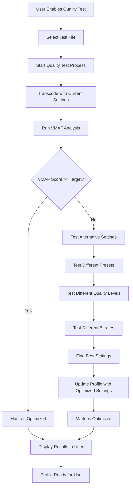

# Quality Test Feature Specification

## Overview

The Quality Test feature enables automatic optimization of transcoding profiles by testing different encoding parameters against a target VMAF quality score (default 91%). When enabled, the system will automatically test and optimize profile settings to achieve the best quality-to-size ratio.

## Feature Goals

- **Automatic Optimization**: Test and optimize transcoding settings automatically
- **Quality Assurance**: Ensure profiles meet target quality standards before use
- **Data-Driven Decisions**: Use VMAF scores to guide profile optimization
- **User Transparency**: Show when profiles have been quality-tested and optimized

## Database Schema Changes

### Profiles Table Extensions

```sql
-- Add Quality Test columns to Profiles table
ALTER TABLE Profiles ADD COLUMN QualityTestEnabled BOOLEAN DEFAULT 0;
ALTER TABLE Profiles ADD COLUMN QualityTestTarget REAL DEFAULT 91.0;
ALTER TABLE Profiles ADD COLUMN QualityTestLastRun TIMESTAMP;
ALTER TABLE Profiles ADD COLUMN QualityTestResults TEXT; -- JSON with test results
ALTER TABLE Profiles ADD COLUMN QualityTestOptimizedSettings TEXT; -- JSON with optimized settings
ALTER TABLE Profiles ADD COLUMN QualityTestStatus TEXT DEFAULT 'Not Tested'; -- Not Tested, Testing, Optimized, Failed
```

### New Quality Test Results Table

```sql
CREATE TABLE QualityTestResults (
    Id INTEGER PRIMARY KEY AUTOINCREMENT,
    ProfileId INTEGER NOT NULL,
    TestFilePath TEXT NOT NULL,
    TestDate TIMESTAMP DEFAULT CURRENT_TIMESTAMP,
    OriginalSettings TEXT NOT NULL, -- JSON of original profile settings
    TestedSettings TEXT NOT NULL, -- JSON of settings used in test
    VMAFScore REAL NOT NULL,
    FileSizeBytes INTEGER NOT NULL,
    TranscodeDurationSeconds REAL NOT NULL,
    PassedThreshold BOOLEAN NOT NULL,
    OptimizationApplied BOOLEAN DEFAULT 0,
    FOREIGN KEY (ProfileId) REFERENCES Profiles(Id)
);
```

## User Interface Changes

### Profile Management Form

#### New Fields Added:
- **Enable Quality Testing**: Checkbox to enable/disable quality testing
- **Target Quality Score**: Numeric input for target VMAF score (default 91.0)
- **Last Tested**: Display field showing when profile was last tested
- **Quality Status**: Status indicator (Not Tested, Testing, Optimized, Failed)

#### Profile List Display:
- **Quality Test Status**: Badge showing test status
- **Optimized Settings**: Indicator when settings have been optimized
- **Test Results**: Link to view detailed test results

### Quality Test Workflow



## Business Logic Implementation

### New Service: ProfileQualityTestService

```python
class ProfileQualityTestService:
    """Business service for profile quality testing and optimization."""
    
    def RunQualityTest(self, ProfileId: int, TestFilePath: str) -> Dict[str, Any]:
        """Run quality test for a profile with a test file."""
        
    def OptimizeProfileSettings(self, ProfileId: int, VMAFResults: List[Dict]) -> Dict[str, Any]:
        """Optimize profile settings based on VMAF test results."""
        
    def GetQualityTestStatus(self, ProfileId: int) -> Dict[str, Any]:
        """Get current quality test status for a profile."""
        
    def GetQualityTestResults(self, ProfileId: int) -> List[Dict[str, Any]]:
        """Get quality test results for a profile."""
```

### Quality Test Algorithm

#### Phase 1: Baseline Test
1. Transcode test file with current profile settings
2. Run VMAF analysis to get baseline score
3. Record file size and transcoding duration

#### Phase 2: Optimization Testing (if baseline < target)
1. **Preset Testing**: Test presets 4, 5, 6, 7, 8
2. **Quality Testing**: Test CRF values 18, 20, 22, 24, 26
3. **Bitrate Testing**: Test different bitrate settings
4. **Codec Testing**: Test different codecs if applicable

#### Phase 3: Optimization Selection
1. Find settings that achieve target VMAF score (91%)
2. If multiple settings meet target, choose smallest file size
3. If no settings meet target, choose highest VMAF score
4. Update profile with optimized settings

### Integration Points

#### Profile Creation/Edit
- Quality test checkbox triggers test when profile is saved
- Background quality testing process
- User notification when test completes

#### Transcoding Queue
- Profiles with `QualityTestEnabled=true` get tested before use
- Use optimized settings if available
- Fallback to original settings if test failed

## API Endpoints

### New Endpoints

```python
# Quality Test Management
POST /api/profiles/{profile_id}/quality-test
GET /api/profiles/{profile_id}/quality-test/status
GET /api/profiles/{profile_id}/quality-test/results
DELETE /api/profiles/{profile_id}/quality-test/results

# Quality Test Execution
POST /api/quality-test/run
GET /api/quality-test/status
POST /api/quality-test/stop
```

## Implementation Phases

### Phase 1: Database Schema (2-3 hours)
- [ ] Add Quality Test columns to Profiles table
- [ ] Create QualityTestResults table
- [ ] Update DatabaseManager with new methods
- [ ] Create database migration script

### Phase 2: UI Updates (4-6 hours)
- [ ] Add Quality Test fields to profile form
- [ ] Update profile list display
- [ ] Add Quality Test status indicators
- [ ] Create Quality Test results view

### Phase 3: Business Logic (8-12 hours)
- [ ] Create ProfileQualityTestService
- [ ] Implement quality test algorithm
- [ ] Integrate with existing VMAF services
- [ ] Add optimization logic

### Phase 4: API Integration (3-4 hours)
- [ ] Create Quality Test API endpoints
- [ ] Update profile management endpoints
- [ ] Add Quality Test status endpoints
- [ ] Implement error handling

### Phase 5: Testing & Integration (4-6 hours)
- [ ] Unit tests for Quality Test service
- [ ] Integration tests with VMAF system
- [ ] UI testing for Quality Test workflow
- [ ] Performance testing

## Quality Test Workflow Details

### Test File Selection
- User selects representative test file
- File should be typical of content to be transcoded
- System validates file format and accessibility

### Testing Process
1. **Baseline Test**: Transcode with current settings
2. **VMAF Analysis**: Run VMAF comparison
3. **Threshold Check**: Compare score to target (91%)
4. **Optimization**: If below threshold, test alternatives
5. **Settings Update**: Apply optimized settings
6. **Results Storage**: Save test results and settings

### Optimization Strategy

#### Parameter Testing Order
1. **Preset Optimization**: Test different encoding presets
2. **Quality Optimization**: Test different CRF values
3. **Bitrate Optimization**: Test different bitrate settings
4. **Codec Optimization**: Test different codecs (if applicable)

#### Selection Criteria
- **Primary**: VMAF score >= target (91%)
- **Secondary**: Smallest file size
- **Tertiary**: Fastest encoding time

## Error Handling

### Common Error Scenarios
- **Test File Not Found**: Validate file path and accessibility
- **Transcoding Failure**: Retry with different settings
- **VMAF Analysis Failure**: Log error and mark test as failed
- **No Optimized Settings**: Use original settings with warning

### User Notifications
- **Test Started**: "Quality test started for profile X"
- **Test Completed**: "Quality test completed - settings optimized"
- **Test Failed**: "Quality test failed - using original settings"
- **Optimization Applied**: "Profile settings optimized for better quality"

## Performance Considerations

### Resource Usage
- **CPU**: Quality testing is CPU-intensive
- **Storage**: Test files and results require storage
- **Time**: Each test takes 1.5x real-time processing

### Optimization Strategies
- **Background Processing**: Run tests in background
- **Caching**: Cache test results for similar files
- **Batch Testing**: Test multiple profiles simultaneously
- **Resource Limits**: Limit concurrent quality tests

## Success Metrics

### Quality Metrics
- **VMAF Score**: Target 91% or higher
- **File Size**: Optimize for smallest size meeting quality target
- **Encoding Speed**: Balance quality with encoding time

### User Experience Metrics
- **Test Completion Rate**: Percentage of successful tests
- **Optimization Rate**: Percentage of profiles that benefit from optimization
- **User Satisfaction**: Feedback on quality test feature

## Future Enhancements

### Advanced Optimization
- **Machine Learning**: Use ML to predict optimal settings
- **Content Analysis**: Analyze content type for better optimization
- **Historical Data**: Use past test results to improve optimization

### User Experience
- **Batch Testing**: Test multiple profiles simultaneously
- **Scheduled Testing**: Automatically test profiles on schedule
- **Quality Reports**: Generate detailed quality reports

## Technical Dependencies

### Existing Services
- **VMAFQueueBusinessService**: For VMAF analysis
- **FFmpegComparisonService**: For quality comparison
- **TranscodeQueueBusinessService**: For transcoding
- **DatabaseManager**: For data persistence

### New Dependencies
- **ProfileQualityTestService**: New service for quality testing
- **QualityTestResults**: New database table
- **Quality Test UI**: New UI components

## Security Considerations

### Data Protection
- **Test Files**: Secure storage of test files
- **Results**: Encrypt sensitive test results
- **Access Control**: Restrict quality test access to authorized users

### Resource Protection
- **Rate Limiting**: Limit quality test frequency
- **Resource Monitoring**: Monitor system resources during testing
- **Cleanup**: Automatic cleanup of old test files

## Conclusion

The Quality Test feature provides automatic optimization of transcoding profiles, ensuring consistent quality while optimizing file sizes. The implementation leverages existing VMAF infrastructure and integrates seamlessly with the current profile management system.

**Estimated Total Development Time**: 21-31 hours
**Complexity Level**: Moderate to High
**Business Value**: High - Automatic quality optimization with minimal user intervention
