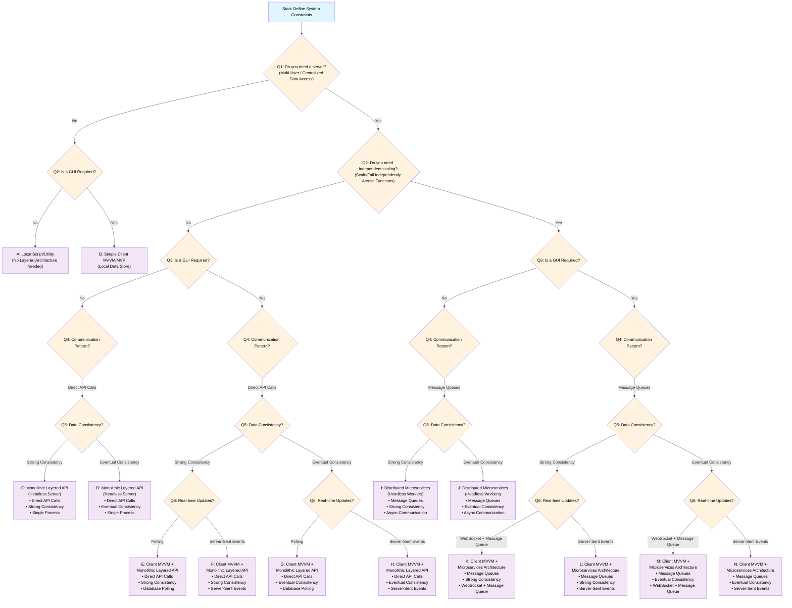

```mermaid
flowchart TD
    A["Start: Define System Constraints"] --> Q1{"Q1: Do you need a server?<br/>(Multi-User / Centralized Data Access)"}

    %% --- Path 1: No Server ---
    Q1 -->|No| Q2{"Q2: Is a GUI Required?"}
    Q2 -->|No| OutcomeA["A: Local Script/Utility<br/>(No Layered Architecture Needed)"]
    Q2 -->|Yes| OutcomeB["B: Simple Client MVVM/MVP<br/>(Local Data Store)"]

    %% --- Path 2: Server Required ---
    Q1 -->|Yes| Q2b{"Q2: Do you need independent scaling?<br/>(Scale/Fail Independently Across Functions)"}
    Q2b -->|No| Q3{"Q3: Is a GUI Required?"}
    Q3 -->|No| Q4a{"Q4: Communication Pattern?"}
    Q4a -->|"Direct API Calls"| Q5a{"Q5: Data Consistency?"}
    Q5a -->|"Strong Consistency"| OutcomeC["C: Monolithic Layered API<br/>(Headless Server)<br/>• Direct API Calls<br/>• Strong Consistency<br/>• Single Process"]
    Q5a -->|"Eventual Consistency"| OutcomeD["D: Monolithic Layered API<br/>(Headless Server)<br/>• Direct API Calls<br/>• Eventual Consistency<br/>• Single Process"]

    Q3 -->|Yes| Q4b{"Q4: Communication Pattern?"}
    Q4b -->|"Direct API Calls"| Q5b{"Q5: Data Consistency?"}
    Q5b -->|"Strong Consistency"| Q6a{"Q6: Real-time Updates?"}
    Q6a -->|"Polling"| OutcomeE["E: Client MVVM +<br/>Monolithic Layered API<br/>• Direct API Calls<br/>• Strong Consistency<br/>• Database Polling"]
    Q6a -->|"Server-Sent Events"| OutcomeF["F: Client MVVM +<br/>Monolithic Layered API<br/>• Direct API Calls<br/>• Strong Consistency<br/>• Server-Sent Events"]
    Q5b -->|"Eventual Consistency"| Q6b{"Q6: Real-time Updates?"}
    Q6b -->|"Polling"| OutcomeG["G: Client MVVM +<br/>Monolithic Layered API<br/>• Direct API Calls<br/>• Eventual Consistency<br/>• Database Polling"]
    Q6b -->|"Server-Sent Events"| OutcomeH["H: Client MVVM +<br/>Monolithic Layered API<br/>• Direct API Calls<br/>• Eventual Consistency<br/>• Server-Sent Events"]

    Q2b -->|Yes| Q3b{"Q3: Is a GUI Required?"}
    Q3b -->|No| Q4c{"Q4: Communication Pattern?"}
    Q4c -->|"Message Queues"| Q5c{"Q5: Data Consistency?"}
    Q5c -->|"Strong Consistency"| OutcomeI["I: Distributed Microservices<br/>(Headless Workers)<br/>• Message Queues<br/>• Strong Consistency<br/>• Async Communication"]
    Q5c -->|"Eventual Consistency"| OutcomeJ["J: Distributed Microservices<br/>(Headless Workers)<br/>• Message Queues<br/>• Eventual Consistency<br/>• Async Communication"]

    Q3b -->|Yes| Q4d{"Q4: Communication Pattern?"}
    Q4d -->|"Message Queues"| Q5d{"Q5: Data Consistency?"}
    Q5d -->|"Strong Consistency"| Q6c{"Q6: Real-time Updates?"}
    Q6c -->|"WebSocket + Message Queue"| OutcomeK["K: Client MVVM +<br/>Microservices Architecture<br/>• Message Queues<br/>• Strong Consistency<br/>• WebSocket + Message Queue"]
    Q6c -->|"Server-Sent Events"| OutcomeL["L: Client MVVM +<br/>Microservices Architecture<br/>• Message Queues<br/>• Strong Consistency<br/>• Server-Sent Events"]
    Q5d -->|"Eventual Consistency"| Q6d{"Q6: Real-time Updates?"}
    Q6d -->|"WebSocket + Message Queue"| OutcomeM["M: Client MVVM +<br/>Microservices Architecture<br/>• Message Queues<br/>• Eventual Consistency<br/>• WebSocket + Message Queue"]
    Q6d -->|"Server-Sent Events"| OutcomeN["N: Client MVVM +<br/>Microservices Architecture<br/>• Message Queues<br/>• Eventual Consistency<br/>• Server-Sent Events"]

    %% Styling
    classDef startNode fill:#e1f5fe,color:#000000
    classDef decisionNode fill:#fff3e0,color:#000000
    classDef outcomeNode fill:#f3e5f5,color:#000000
    classDef refinementNode fill:#e8f5e8,color:#000000

    class A startNode
    class Q1,Q2,Q2b,Q3,Q3b,Q4a,Q4b,Q4c,Q4d,Q5a,Q5b,Q5c,Q5d,Q6a,Q6b,Q6c,Q6d decisionNode
    class OutcomeA,OutcomeB,OutcomeC,OutcomeD,OutcomeE,OutcomeF,OutcomeG,OutcomeH,OutcomeI,OutcomeJ,OutcomeK,OutcomeL,OutcomeM,OutcomeN outcomeNode
```