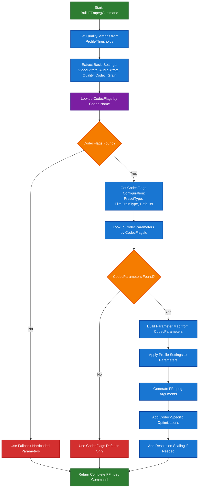

# FFmpeg Command Building Workflow

This document describes the complete workflow for building FFmpeg transcoding commands using the CodecFlags and CodecParameters system.

## Overview

The FFmpeg command building process should integrate multiple data sources to create optimized, codec-specific transcoding commands:

1. **ProfileThresholds**: Basic transcoding settings (bitrates, quality, grain)
2. **Profiles**: Codec selection
3. **CodecFlags**: Codec-specific configuration (preset types, film grain types)
4. **CodecParameters**: Individual FFmpeg flags and parameters for each codec

## Current vs Ideal Implementation

### Current Implementation (Basic)
- Hardcoded FFmpeg parameters
- Simple codec-specific optimizations
- No integration with CodecFlags/CodecParameters
- Missing grain and advanced parameter support

### Ideal Implementation (Complete)
- Dynamic parameter lookup from CodecFlags/CodecParameters
- Codec-specific preset and parameter selection
- Full grain and advanced feature support
- Extensible for new codecs and parameters

## Data Flow Architecture



## Detailed Workflow Steps

### Step 1: Input Processing
- **Input**: QualitySettings dictionary from ProfileThresholds
- **Extract**: VideoBitrateKbps, AudioBitrateKbps, Quality, Codec, Grain, TargetResolution
- **Validate**: All required settings present

### Step 2: CodecFlags Lookup
- **Query**: `SELECT * FROM CodecFlags WHERE CodecName = ?`
- **Get**: PresetType, FilmGrainType, PresetMin/Max/Default, FilmGrainMin/Max/Default
- **Purpose**: Understand codec capabilities and parameter types

### Step 3: CodecParameters Lookup
- **Query**: `SELECT * FROM CodecParameters WHERE CodecFlagsId = ?`
- **Get**: ParameterName, ParameterType, MinValue, MaxValue, DefaultValue, FFmpegFlag
- **Purpose**: Get all available FFmpeg flags for the codec

### Step 4: Parameter Mapping
- **Map Profile Settings to CodecParameters**:
  - Quality → CRF/QP parameter
  - Grain → Film grain parameter
  - Preset → Preset parameter (if available)
- **Apply Validation**: Check min/max ranges from CodecParameters
- **Use Defaults**: Apply CodecParameters defaults for missing settings

### Step 5: FFmpeg Argument Generation
- **Base Arguments**: Input file, output file, codec selection
- **Quality Arguments**: CRF/QP based on CodecParameters
- **Bitrate Arguments**: Maxrate, bufsize from ProfileThresholds
- **Audio Arguments**: Audio codec and bitrate
- **Codec-Specific Arguments**: Generated from CodecParameters FFmpegFlag
- **Grain Arguments**: Applied if Grain setting > 0
- **Preset Arguments**: Applied if preset available in CodecParameters

### Step 6: Advanced Features
- **Resolution Scaling**: Add scale filter if TranscodeDownTo is set
- **Threading**: Add thread optimization parameters
- **Streaming Optimization**: Add movflags +faststart
- **Codec-Specific Optimizations**: x264-params, x265-params, etc.

## Codec-Specific Examples

### libx265 (H.265) Example
```bash
ffmpeg -i input.mkv \
  -c:v libx265 \
  -crf 22 \
  -preset 6 \
  -maxrate 3000k \
  -bufsize 6000k \
  -x265-params "threads=0:frame-threads=0" \
  -tune grain \
  -c:a aac \
  -b:a 192k \
  -vf "scale=1280:720:force_original_aspect_ratio=decrease,pad=1280:720:(ow-iw)/2:(oh-ih)/2" \
  -movflags +faststart \
  -y output.mkv
```

### libsvtav1 (AV1) Example
```bash
ffmpeg -i input.mkv \
  -c:v libsvtav1 \
  -crf 30 \
  -preset 6 \
  -maxrate 2000k \
  -bufsize 4000k \
  -svtav1-params "film-grain=10:tune=0" \
  -c:a aac \
  -b:a 128k \
  -vf "scale=1920:1080:force_original_aspect_ratio=decrease,pad=1920:1080:(ow-iw)/2:(oh-ih)/2" \
  -movflags +faststart \
  -y output.mkv
```

## Database Schema Integration

### CodecFlags Table
- **CodecName**: libx265, libsvtav1, libx264, libvpx-vp9
- **PresetType**: "numeric" or "string"
- **PresetMin/Max/Default**: Range and default for presets
- **FilmGrainType**: "boolean" or "numeric"
- **FilmGrainMin/Max/Default**: Range and default for grain

### CodecParameters Table
- **CodecFlagsId**: Foreign key to CodecFlags
- **ParameterName**: crf, qp, preset, film-grain, tune
- **ParameterType**: integer, float, string, boolean
- **MinValue/MaxValue**: Validation ranges
- **DefaultValue**: Default parameter value
- **FFmpegFlag**: Actual FFmpeg flag (-crf, -svtav1-params film-grain)

### ProfileThresholds Integration
- **Quality**: Maps to CRF/QP parameters
- **Grain**: Maps to film grain parameters
- **VideoBitrateKbps**: Used for maxrate/bufsize
- **AudioBitrateKbps**: Used for audio bitrate
- **TranscodeDownTo**: Used for resolution scaling

## Decision Points

### 1. CodecFlags Availability
- **Found**: Use full CodecFlags/CodecParameters system
- **Not Found**: Fall back to hardcoded parameters

### 2. CodecParameters Availability
- **Found**: Use dynamic parameter generation
- **Not Found**: Use CodecFlags defaults only

### 3. Parameter Validation
- **Valid**: Use profile setting value
- **Invalid**: Use CodecParameters default value
- **Missing**: Use CodecParameters default value

### 4. Grain Setting
- **Grain > 0**: Apply grain parameters based on codec
- **Grain = 0**: Skip grain parameters

### 5. Resolution Scaling
- **TranscodeDownTo Set**: Add scale filter
- **No Scaling**: Skip scale filter

## Error Handling

### Missing CodecFlags
- Log warning about missing codec configuration
- Use hardcoded fallback parameters
- Continue with basic transcoding

### Missing CodecParameters
- Log warning about missing parameter configuration
- Use CodecFlags defaults only
- Continue with limited parameter set

### Invalid Parameter Values
- Log warning about invalid parameter
- Use CodecParameters default value
- Continue with corrected parameter

### Database Errors
- Log error about database lookup failure
- Use hardcoded fallback parameters
- Continue with basic transcoding

## Benefits of Complete Implementation

### 1. Extensibility
- Easy to add new codecs by adding CodecFlags/CodecParameters entries
- No code changes required for new codec support
- Dynamic parameter discovery

### 2. Maintainability
- Centralized codec configuration in database
- Easy to update parameters without code changes
- Consistent parameter validation

### 3. Optimization
- Codec-specific optimizations applied automatically
- Proper parameter ranges and defaults
- Advanced features like grain synthesis

### 4. User Experience
- Rich parameter configuration through UI
- Validation and helpful descriptions
- Consistent behavior across codecs

## Implementation Priority

### Phase 1: Basic Integration
1. Add CodecFlags lookup to BuildFFmpegCommand
2. Add CodecParameters lookup
3. Implement basic parameter mapping
4. Add fallback handling

### Phase 2: Advanced Features
1. Implement grain parameter support
2. Add preset parameter support
3. Implement parameter validation
4. Add codec-specific optimizations

### Phase 3: UI Integration
1. Add CodecFlags/CodecParameters management UI
2. Add parameter validation in UI
3. Add parameter descriptions and help
4. Add codec-specific parameter groups

## Related Documentation

- [TranscodingWorkflow.md](TranscodingWorkflow.md) - Overall transcoding process
- [DatabaseSchema.md](../DatabaseSchema.md) - CodecFlags and CodecParameters tables
- [Architecture.md](../Architecture.md) - Overall system architecture
- [CodecOptionsIndex.md](../Codecs/CodecOptionsIndex.md) - Codec-specific documentation
