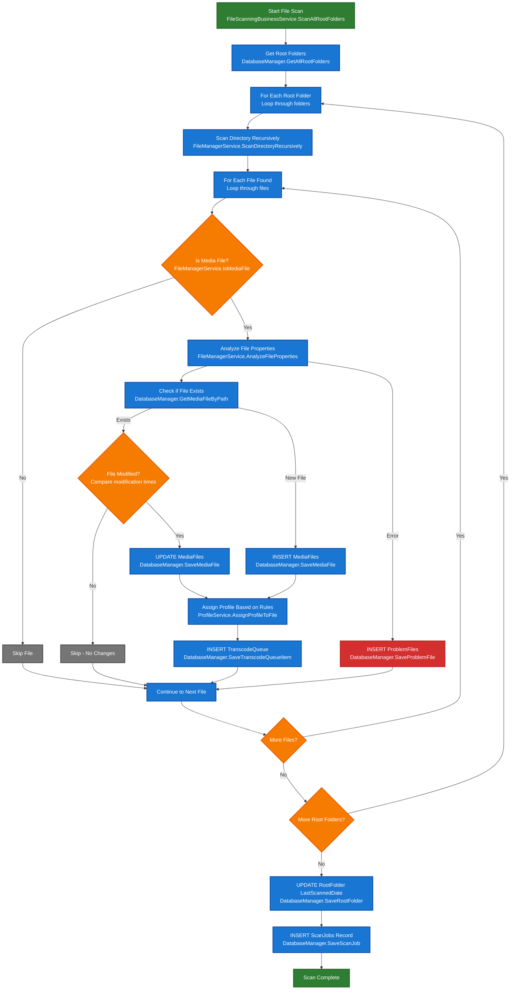

# File Scanning Workflow

This diagram shows the complete file scanning process from root folder discovery to transcode queue population.

## Key Components

### Database Tables Updated:
- **RootFolders**: LastScannedDate updated
- **MediaFiles**: New files added, existing files updated if modified
- **TranscodeQueue**: Files added for transcoding
- **ProblemFiles**: Files with analysis errors
- **ScanJobs**: Scan job tracking and progress

### Key Decision Points:
1. **Media File Check**: Only process video/audio files
2. **File Existence**: Handle new vs existing files differently
3. **File Modification**: Only update if file has changed
4. **Profile Assignment**: Apply transcoding rules based on file properties

### Error Handling:
- Files that can't be analyzed go to ProblemFiles table
- Scan continues even if individual files fail
- ScanJobs table tracks overall progress and errors

