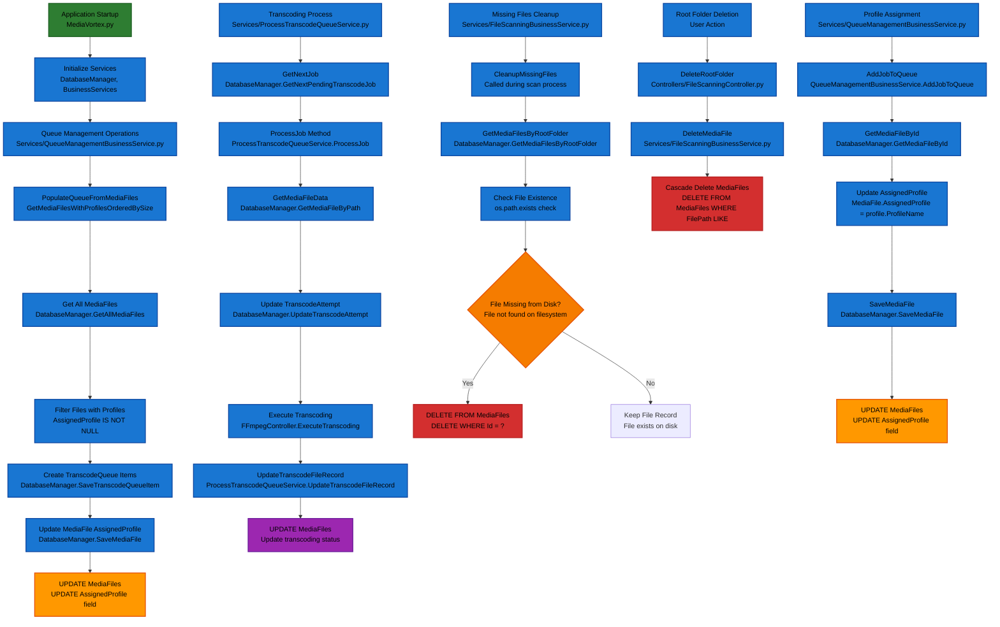

# MediaFiles Workflow

This document shows the complete MediaFiles table operations workflow for different scenarios in the MediaVortex application.

## Scenario A: File Scan

This diagram shows the complete file scanning process that results in INSERT and UPDATE operations on the MediaFiles table.

```mermaid
flowchart TD
    A[User Clicks Scan Button<br/>Templates/FileScanning.html] --> B[StartScan JavaScript Function<br/>AJAX POST to /api/Scan/Start]
    B --> C[StartScan Endpoint<br/>Controllers/FileScanningController.py]
    C --> D[StartScanning Method<br/>ViewModels/FileScanningViewModel.py]
    D --> E[StartScanning Method<br/>Services/FileScanningBusinessService.py]
    E --> F[CreateScanJob<br/>INSERT INTO ScanJobs table]
    F --> G[Start Subprocess<br/>Scripts/ScanDirectoryProcess.py]
    G --> H[ScanDirectory Method<br/>Scripts/ScanDirectoryProcess.py]
    H --> I[GetOrCreateRootFolder<br/>INSERT/UPDATE RootFolders table]
    I --> J[FileManagerService.ScanDirectory<br/>Find media files on disk]
    J --> K[ProcessMediaFilesWithMetadata<br/>Services/FileScanningBusinessService.py]
    K --> L[For Each File Found<br/>Loop through files]
    L --> M[ProcessSingleMediaFile<br/>Services/FileScanningBusinessService.py]
    M --> N{File Exists in DB?<br/>DatabaseManager.GetMediaFileByPath}
    N -->|Yes| O{File Changed?<br/>Compare modification times}
    N -->|No| P[Check for Fuzzy Match<br/>FindFuzzyFileMatch]
    O -->|No| Q[Update LastScannedDate Only<br/>UPDATE MediaFiles SET LastScannedDate = ?]
    O -->|Yes| R[Update Existing MediaFileModel<br/>Update properties]
    P -->|Found| S[Update Fuzzy Match<br/>Update existing record with new path]
    P -->|Not Found| T[Create New MediaFileModel<br/>MediaFileModel constructor]
    R --> U[Extract Metadata<br/>ExtractAndUpdateMetadata]
    S --> U
    T --> U
    U --> V[SaveMediaFile Method<br/>DatabaseManager.SaveMediaFile]
    V --> W{MediaFile.Id is None?<br/>Check if new file}
    W -->|Yes| X[INSERT INTO MediaFiles<br/>INSERT statement with all fields]
    W -->|No| Y[UPDATE MediaFiles<br/>UPDATE statement with all fields]
    Q --> Z[Continue to Next File]
    X --> Z
    Y --> Z
    Z --> AA{More Files?}
    AA -->|Yes| L
    AA -->|No| BB[Update RootFolder Size<br/>UPDATE RootFolders SET TotalSizeGB]
    BB --> CC[Update ScanJobs Status<br/>UPDATE ScanJobs SET Status = 'Completed']
    CC --> DD[Scan Complete<br/>Return to UI]
    
    %% Styling with black text
    classDef startEnd fill:#2e7d32,stroke:#1b5e20,stroke-width:2px,color:#000000
    classDef process fill:#1976d2,stroke:#0d47a1,stroke-width:2px,color:#000000
    classDef decision fill:#f57c00,stroke:#e65100,stroke-width:2px,color:#000000
    classDef database fill:#9c27b0,stroke:#6a1b9a,stroke-width:2px,color:#000000
    classDef error fill:#d32f2f,stroke:#b71c1c,stroke-width:2px,color:#000000
    
    class A,DD startEnd
    class B,C,D,E,G,H,I,J,K,L,M,R,S,T,U,V,Z process
    class N,O,P,W,AA decision
    class F,Q,X,Y,BB,CC database
```



## Scenario B: Refresh

This diagram shows the manual refresh process for a single media file that results in UPDATE operations on the MediaFiles table.

```mermaid
flowchart TD
    A[User Clicks Refresh Button<br/>Templates/FileScanning.html] --> B[RefreshMediaFile JavaScript Function<br/>Static/js/FileScanning.js]
    B --> C[POST /api/MediaFiles/{id}/Refresh<br/>Controllers/FileScanningController.py]
    C --> D[RefreshMediaFile Method<br/>ViewModels/FileScanningViewModel.py]
    D --> E[GetMediaFileById<br/>DatabaseManager.GetMediaFileById]
    E --> F{File Exists on Disk?<br/>os.path.exists check}
    F -->|Yes| G[ProcessSingleMediaFile<br/>Services/FileScanningBusinessService.py]
    F -->|No| H[Search Season Directory<br/>Look for matching S##E## pattern]
    H --> I{Found Matching File?<br/>Pattern matching in directory}
    I -->|Yes| J[ProcessSingleMediaFile with New Path<br/>Services/FileScanningBusinessService.py]
    I -->|No| K[Return Error<br/>File not found]
    G --> L[Get File Information<br/>FileManager.GetFileSizeMB, GetFileNameFromPath]
    J --> L
    L --> M[Check if File Changed<br/>Compare with existing record]
    M --> N{File Has Changed?<br/>Size, name, or modification time}
    N -->|Yes| O[Update MediaFileModel Properties<br/>SizeMB, FileName, FileModificationTime]
    N -->|No| P[Update LastScannedDate Only<br/>Skip metadata extraction]
    O --> Q[Extract Metadata<br/>FFmpegAnalysisService.ExtractMetadata]
    P --> R[SaveMediaFile Method<br/>DatabaseManager.SaveMediaFile]
    Q --> R
    R --> S[UPDATE MediaFiles<br/>UPDATE statement with all fields]
    S --> T[Return Success Response<br/>JSON response to UI]
    K --> U[Return Error Response<br/>JSON error response]
    
    %% Styling with black text
    classDef startEnd fill:#2e7d32,stroke:#1b5e20,stroke-width:2px,color:#000000
    classDef process fill:#1976d2,stroke:#0d47a1,stroke-width:2px,color:#000000
    classDef decision fill:#f57c00,stroke:#e65100,stroke-width:2px,color:#000000
    classDef database fill:#9c27b0,stroke:#6a1b9a,stroke-width:2px,color:#000000
    classDef error fill:#d32f2f,stroke:#b71c1c,stroke-width:2px,color:#000000
    
    class A,T,U startEnd
    class B,C,D,G,J,L,O,Q process
    class F,I,M,N decision
    class E,R,S database
    class K error
```

## Scenario C: Auto-Call Operations

This diagram shows the automatic operations that occur during normal application operation, including queue management and cleanup operations.



## Key Database Operations Summary

### INSERT Operations:
- **New Media Files**: `INSERT INTO MediaFiles` with all metadata fields
- **TranscodeQueue Items**: `INSERT INTO TranscodeQueue` for transcoding jobs

### UPDATE Operations:
- **File Changes**: `UPDATE MediaFiles` when file properties change
- **Profile Assignment**: `UPDATE MediaFiles SET AssignedProfile = ?`
- **Scan Dates**: `UPDATE MediaFiles SET LastScannedDate = ?`
- **Transcoding Status**: `UPDATE MediaFiles` for transcoding progress

### DELETE Operations:
- **Missing Files**: `DELETE FROM MediaFiles WHERE Id = ?` for files not on disk
- **Root Folder Deletion**: `DELETE FROM MediaFiles WHERE FilePath LIKE` (cascade delete)
- **Manual Deletion**: `DELETE FROM MediaFiles WHERE Id = ?` (user action)

## Call Hierarchy Summary

### File Scan Flow (Actual Code Path):
```
1. Templates/FileScanning.html → StartScan() JavaScript function
2. Controllers/FileScanningController.py → StartScan() endpoint
3. ViewModels/FileScanningViewModel.py → StartScanning() method
4. Services/FileScanningBusinessService.py → StartScanning() method
5. Services/FileScanningBusinessService.py → CreateScanJob() method
6. Scripts/ScanDirectoryProcess.py → ScanDirectory() method
7. Scripts/ScanDirectoryProcess.py → GetOrCreateRootFolder() method
8. Services/FileManagerService.py → ScanDirectory() method
9. Services/FileScanningBusinessService.py → ProcessMediaFilesWithMetadata() method
10. Services/FileScanningBusinessService.py → ProcessSingleMediaFile() method
11. Services/FileScanningBusinessService.py → ExtractAndUpdateMetadata() method
12. Repositories/DatabaseManager.py → SaveMediaFile() method
13. Repositories/DatabaseManager.py → INSERT/UPDATE MediaFiles table
```

### Refresh Flow:
```
UI → Controller → ViewModel → ProcessSingleMediaFile → SaveMediaFile
```

### Auto-Call Flows:
```
Queue Management: BusinessService → GetMediaFiles → SaveMediaFile
Cleanup: BusinessService → CleanupMissingFiles → ExecuteNonQuery
Transcoding: ProcessTranscodeQueueService → GetMediaFileData → UpdateTranscodeFileRecord
```

## MVVM Architecture Components

### **View Layer (UI)**
- **File**: `Templates/FileScanning.html`
- **Role**: User interface, button clicks, progress display
- **Key Method**: `StartScan()` JavaScript function
- **Calls**: AJAX POST to `/api/Scan/Start`

### **Controller Layer (API Endpoints)**
- **File**: `Controllers/FileScanningController.py`
- **Role**: HTTP request handling, parameter validation
- **Key Method**: `StartScan()` endpoint
- **Calls**: `ViewModel.StartScanning()`

### **ViewModel Layer (Presentation Logic)**
- **File**: `ViewModels/FileScanningViewModel.py`
- **Role**: UI state management, business service coordination
- **Key Method**: `StartScanning()`
- **Calls**: `BusinessService.StartScanning()`

### **Business Service Layer (Core Logic)**
- **File**: `Services/FileScanningBusinessService.py`
- **Role**: Business logic orchestration, subprocess management
- **Key Methods**: 
  - `StartScanning()` - Creates scan job and starts subprocess
  - `ProcessMediaFilesWithMetadata()` - Processes files in batches
  - `ProcessSingleMediaFile()` - Handles individual file processing
  - `ExtractAndUpdateMetadata()` - Extracts file metadata
- **Calls**: `DatabaseManager.SaveMediaFile()`

### **Subprocess Layer (File Processing)**
- **File**: `Scripts/ScanDirectoryProcess.py`
- **Role**: Separate process for file scanning, prevents UI blocking
- **Key Methods**:
  - `ScanDirectory()` - Main scanning orchestration
  - `GetOrCreateRootFolder()` - Root folder management
- **Calls**: `FileScanningBusinessService.ProcessMediaFilesWithMetadata()`

### **File Management Layer**
- **File**: `Services/FileManagerService.py`
- **Role**: File system operations, media file detection
- **Key Method**: `ScanDirectory()` - Finds media files on disk
- **Calls**: Returns list of file paths to subprocess

### **Database Layer**
- **File**: `Repositories/DatabaseManager.py`
- **Role**: Data persistence, SQL operations
- **Key Methods**:
  - `SaveMediaFile()` - INSERT/UPDATE MediaFiles table
  - `GetMediaFileByPath()` - Check if file exists
  - `GetAllProfileThresholds()` - Get profile configuration
- **Calls**: Direct SQL operations on database

## Key Files and Methods

### Database Layer:
- `Repositories/DatabaseManager.py`: `SaveMediaFile()`, `DeleteMediaFile()`, `GetMediaFileByPath()`, `GetAllMediaFiles()`

### Business Logic Layer:
- `Services/FileScanningBusinessService.py`: `ProcessSingleMediaFile()`, `CleanupMissingFiles()`
- `Services/QueueManagementBusinessService.py`: `PopulateQueueFromMediaFiles()`, `AddJobToQueue()`
- `Services/ProcessTranscodeQueueService.py`: `ProcessJob()`, `UpdateTranscodeFileRecord()`

### Presentation Layer:
- `ViewModels/FileScanningViewModel.py`: `StartScanning()`, `RefreshMediaFile()`, `DeleteMediaFile()`
- `Controllers/FileScanningController.py`: `StartScan()`, `DeleteMediaFile()`, `RefreshMediaFile()`

### Subprocess Layer:
- `Scripts/ScanDirectoryProcess.py`: `ScanDirectory()`, `GetOrCreateRootFolder()`

### File Management Layer:
- `Services/FileManagerService.py`: `ScanDirectory()`, `GetFileSizeMB()`, `GetFileNameFromPath()`

This workflow ensures proper MVVM architecture, single responsibility, and comprehensive MediaFiles table management across all application scenarios.
