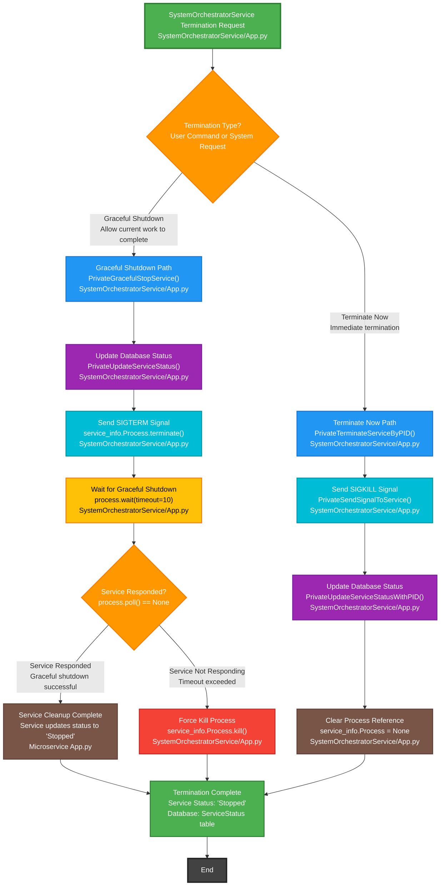
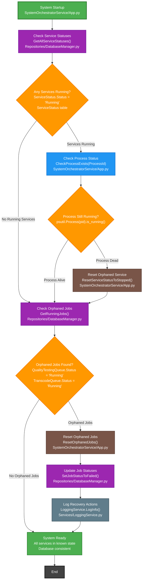

# Microservices Termination Workflow

## SystemOrchestratorService Termination Decision Tree



## Microservice Graceful Shutdown Response

```mermaid
flowchart TD
    A["Microservice Receives SIGTERM<br/>Main.py SignalHandler()<br/>QualityCompareService/Main.py"]:::startNode
    B["Log Shutdown Signal<br/>LoggingService.LogInfo()<br/>Services/LoggingService.py"]:::logNode
    C["Call App.Shutdown()<br/>Microservice App.py"]:::processNode
    D["Set ShutdownEvent<br/>self.ShutdownEvent.set()<br/>Microservice App.py"]:::signalNode
    E["Stop Processing Loop<br/>self.IsRunning = False<br/>Microservice App.py"]:::processNode
    F["Wait for Current Operations<br/>Thread.join(timeout=5)<br/>Microservice App.py"]:::waitNode
    G["Update Service Status<br/>UpdateServiceStatus('Stopping')<br/>Microservice App.py"]:::databaseNode
    H["Call App.Cleanup()<br/>Microservice App.py"]:::processNode
    I["Reset Active Jobs<br/>ResetActiveJobs()<br/>Microservice App.py"]:::cleanupNode
    J["Cancel Running Threads<br/>CancelActiveThreads()<br/>Microservice App.py"]:::cleanupNode
    K["Update Job Statuses<br/>UpdateJobStatusesToFailed()<br/>Microservice App.py"]:::databaseNode
    L["Update Final Status<br/>UpdateServiceStatus('Stopped', 'Stopped')<br/>Microservice App.py"]:::databaseNode
    M["Log Cleanup Complete<br/>LoggingService.LogInfo()<br/>Services/LoggingService.py"]:::logNode
    N["Exit Process<br/>sys.exit(0)<br/>Microservice Main.py"]:::endNode

    A --> B
    B --> C
    C --> D
    D --> E
    E --> F
    F --> G
    G --> H
    H --> I
    I --> J
    J --> K
    K --> L
    L --> M
    M --> N

    classDef startNode fill:#4CAF50,stroke:#2E7D32,stroke-width:3px,color:#FFFFFF
    classDef logNode fill:#607D8B,stroke:#455A64,stroke-width:2px,color:#FFFFFF
    classDef processNode fill:#2196F3,stroke:#1976D2,stroke-width:2px,color:#FFFFFF
    classDef signalNode fill:#00BCD4,stroke:#0097A7,stroke-width:2px,color:#FFFFFF
    classDef waitNode fill:#FFC107,stroke:#F57F17,stroke-width:2px,color:#000000
    classDef databaseNode fill:#9C27B0,stroke:#7B1FA2,stroke-width:2px,color:#FFFFFF
    classDef endNode fill:#424242,stroke:#212121,stroke-width:3px,color:#FFFFFF
```



## Key Components

### Files Involved:
- **SystemOrchestratorService/App.py** - Main orchestrator termination logic
- **QualityCompareService/Main.py** - Microservice signal handling
- **QualityCompareService/App.py** - Microservice shutdown logic
- **TranscodeService/Main.py** - Microservice signal handling
- **TranscodeService/app.py** - Microservice shutdown logic
- **Services/LoggingService.py** - Centralized logging
- **Repositories/DatabaseManager.py** - Database status updates

### Classes & Methods:
- **SystemOrchestratorService.PrivateGracefulStopService()** - Graceful shutdown coordination
- **SystemOrchestratorService.PrivateTerminateServiceByPID()** - Immediate termination
- **SystemOrchestratorService.PrivateSendSignalToService()** - Signal sending
- **SystemOrchestratorService.PrivateUpdateServiceStatus()** - Database status updates
- **Microservice.SignalHandler()** - Signal reception and processing
- **Microservice.App.Shutdown()** - Graceful shutdown logic
- **Microservice.App.Cleanup()** - Resource cleanup
- **Microservice.App.UpdateServiceStatus()** - Status reporting

### Database Tables & Columns:
- **ServiceStatus.Status** - Service running status (Running/Stopping/Stopped)
- **ServiceStatus.HealthStatus** - Service health (Healthy/Stopping/Stopped)
- **ServiceStatus.UpdatedAt** - Last status update timestamp
- **ServiceStatus.ProcessId** - Current process ID
- **ServiceStatus.ActiveJobsCount** - Current active jobs count
- **ServiceStatus.IsProcessing** - Whether service is processing jobs

### Termination Types:

#### Graceful Shutdown:
1. **Database Coordination** - Set status to "GracefulStop"
2. **Signal Sending** - Send SIGTERM to process
3. **Wait Period** - Allow 10 seconds for graceful shutdown
4. **Service Response** - Service finishes current work and updates status
5. **Process Termination** - Terminate process after confirmation
6. **Cleanup** - Clear process references

#### Terminate Now:
1. **Immediate Signal** - Send SIGKILL to process
2. **No Coordination** - No database status coordination
3. **Force Kill** - Process terminated immediately
4. **Status Update** - Update database to "Stopped"
5. **Cleanup** - Clear process references

### Signal Types:
- **SIGTERM** - Graceful shutdown request (allows cleanup)
- **SIGINT** - Interrupt signal (Ctrl+C equivalent)
- **SIGKILL** - Force termination (cannot be caught or ignored)

### Cleanup Requirements:

#### Graceful Shutdown Cleanup:
- **Thread Management** - Join all active threads with timeout
- **Active Job Reset** - ResetActiveJobs() - Set all running jobs to "Failed" status
- **Thread Cancellation** - CancelActiveThreads() - Stop all running quality test threads
- **Job Status Updates** - UpdateJobStatusesToFailed() - Mark incomplete jobs as failed
- **Database Updates** - Update service status to "Stopping" then "Stopped"
- **Resource Cleanup** - Close database connections, file handles
- **Logging** - Log shutdown completion
- **Process Exit** - Clean exit with sys.exit(0)

#### Terminate Now Cleanup:
- **Process Kill** - Immediate SIGKILL signal
- **Database Update** - Force update status to "Stopped"
- **Reference Cleanup** - Clear process references in orchestrator
- **No Service Cleanup** - Service cannot perform cleanup (killed immediately)

#### Crash Recovery Cleanup:
- **System Startup Check** - Check for orphaned jobs on service startup
- **Orphaned Job Detection** - Find jobs with "Running" status but no active process
- **Job Status Reset** - ResetOrphanedJobs() - Set orphaned jobs to "Failed" status
- **Service Status Reset** - ResetServiceStatusToStopped() - Clear stuck service statuses
- **Database Consistency** - Ensure database reflects actual system state
- **Health Check** - Verify all services are in known good state before starting

### Status Flow:
```
Running → GracefulStop → Stopping → Stopped (Graceful)
Running → Stopped (Terminate Now)
```

### Error Handling:
- **Timeout Handling** - Force kill if graceful shutdown times out
- **Process Monitoring** - Check if process is still running
- **Database Consistency** - Ensure status reflects actual process state
- **Logging** - Log all termination attempts and results

## Crash Recovery Workflow



### External Dependencies:
- **os.kill()** - System signal sending
- **subprocess.Process** - Process management
- **threading.Event** - Shutdown coordination
- **signal.signal()** - Signal handler registration
- **DatabaseService** - Status persistence
- **psutil.Process** - Process existence checking
- **DatabaseManager** - Orphaned job detection and cleanup
