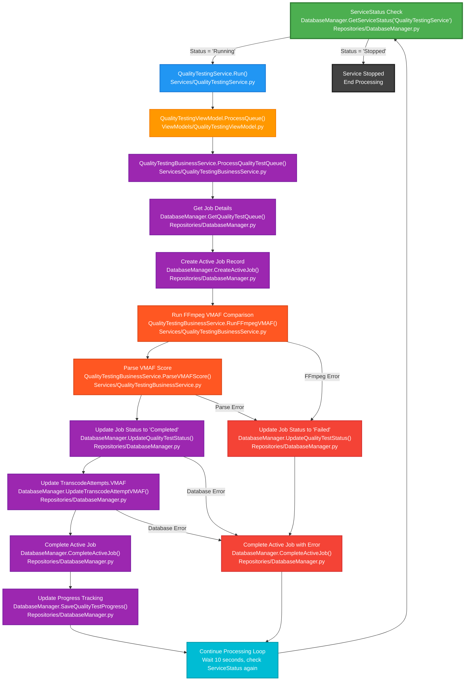

# Quality Testing Architecture - MicroService MVVM + KISS

## Database-Driven MicroService Quality Testing Workflow



## MicroService MVVM Architecture (KISS + Database-Driven)

### **Services (MicroService Entry Point)**
- **QualityTestingService** - Main microservice entry point
  - `Run()` - Check ServiceStatus and start processing loop
  - `Initialize()` - Initialize dependencies
  - `Shutdown()` - Graceful shutdown

### **ViewModels (Presentation Logic)**
- **QualityTestingViewModel** - Presentation logic layer
  - `ProcessQueue()` - Process quality test queue
  - `GetActiveJobs()` - Get list of active jobs
  - `CheckServiceStatus()` - Check if service should run

### **Services (Business Logic)**
- **QualityTestingBusinessService** - Business logic layer
  - `ProcessQualityTestQueue()` - Process pending quality test jobs
  - `StartQualityTest(JobId)` - Start quality test for specific job
  - `RunFFmpegVMAF(OriginalFilePath, TranscodedFilePath)` - Execute FFmpeg VMAF comparison
  - `ParseVMAFScore(ffmpeg_output)` - Extract VMAF score from FFmpeg output
  - `MonitorProgress(Process, JobId)` - Monitor FFmpeg progress and update database
  - `CheckConcurrencyLimit()` - Check MaxConcurrentJobs limit

### **Repositories (Data Access)**
- **DatabaseManager** - Main database access
  - `GetServiceStatus(service_name)` - Check if service should run/stop
  - `GetQualityTestQueue()` - Get pending jobs from QualityTestingQueue
  - `CreateActiveJob(ServiceName, JobType, QueueId)` - Track job execution
  - `SaveQualityTestProgress(JobId, ProgressData)` - Update progress in QualityTestProgress
  - `GetMaxConcurrentJobs()` - Get concurrency limit from ServiceStatus
  - `UpdateQualityTestStatus(JobId, Status, VMAFScore)` - Update job status and results
  - `UpdateTranscodeAttemptVMAF(TranscodeAttemptId, VMAFScore)` - Update TranscodeAttempts.VMAF
  - `CompleteActiveJob(JobId, Success, ErrorMessage)` - Complete active job record

## KISS Principles Applied

### **1. Single Responsibility**
- **Service**: Only microservice entry point and status checking
- **ViewModel**: Only presentation logic and coordination
- **BusinessService**: Only quality test business logic
- **Repository**: Only data access

### **2. Simple Flow**
- Service checks ServiceStatus table
- If Running: Process queue, get job details from database
- Create active job record, run FFmpeg VMAF comparison
- Parse VMAF score from output, update job status and results
- Update TranscodeAttempts with VMAF score, complete active job record
- Continue processing loop, check ServiceStatus again

### **3. Minimal Dependencies**
- Service → ViewModel (presentation logic)
- ViewModel → BusinessService (business logic)
- BusinessService → Repository (data access)
- BusinessService → subprocess (FFmpeg execution)
- No complex orchestration, just database-driven control

### **4. Clear Separation**
- **Database-driven control** - ServiceStatus table controls start/stop
- **Async execution** - Background processing with progress tracking
- **Progress tracking** - Real-time updates in QualityTestProgress table
- **Concurrency management** - MaxConcurrentJobs from ServiceStatus

## Architecture Benefits

### **MVVM Compliance**
- **Separation of Concerns**: Service handles entry point, ViewModel handles presentation, BusinessService handles logic, Repository handles data
- **Testability**: Each layer can be tested independently
- **Maintainability**: Changes to one layer don't affect others

### **KISS Principles**
- **Single Responsibility**: Each layer has one clear purpose
- **Minimal Dependencies**: Database-driven control, no complex abstractions
- **Clear Data Flow**: Linear progression through the MVVM layers
- **Simple Error Handling**: Standard try/catch with status updates

## Benefits of MicroService Approach

### **Database-Driven Benefits**
- **Simple Control**: ServiceStatus table controls start/stop
- **GUI Integration Ready**: Easy to tie into existing GUI controls
- **Manual Control**: Database setting can be changed directly for testing
- **Scalable**: Can easily add more microservices

### **FFmpeg Integration Benefits**
- **PID Capture**: subprocess.Popen() captures FFmpeg PID
- **Real-time Progress**: Frame counts and processing speed tracking
- **XML VMAF Output**: Structured quality score parsing
- **Async Execution**: Background processing with progress monitoring

## Implementation Strategy

### **Phase 1: MicroService Foundation**
- Create QualityTestingService with database-driven control
- Implement ServiceStatus checking and processing loop
- Add proper MVVM layer separation

### **Phase 2: Business Logic Implementation**
- Create QualityTestingBusinessService with FFmpeg integration
- Implement subprocess execution with PID capture
- Add progress monitoring and VMAF score parsing

### **Phase 3: Database Integration**
- Use existing QualityTestingQueue table for job tracking
- Use ActiveJobs table for concurrent job management
- Implement QualityTestProgress table for real-time updates

### **Phase 4: GUI Integration (Future)**
- Add web UI controls for ServiceStatus management
- Display active jobs and progress in existing GUI
- Integrate with existing queue management system

## File Structure
```
Services/
  QualityTestingService.py
ViewModels/
  QualityTestingViewModel.py
Services/
  QualityTestingBusinessService.py
Repositories/
  DatabaseManager.py
```

## Key Features Included

### **✅ All Essential Features:**
- **Database-Driven Control** - ServiceStatus table controls microservice start/stop
- **FFmpeg Integration** - VMAF comparison execution with PID capture
- **Simple Job Management** - QualityTestingQueue table for job tracking
- **Quality Test Results Storage** - VMAF score and results persistence
- **Active Jobs Tracking** - Unified ActiveJobs table for concurrent job management
- **Progress Tracking** - Real-time updates in QualityTestProgress table
- **Error Handling** - Quality test errors and process failures
- **Database Integration** - All data operations through DatabaseManager
- **Concurrency Management** - MaxConcurrentJobs from ServiceStatus table

### **✅ MVVM Compliance:**
- **Services** - Microservice entry point only
- **ViewModels** - Presentation logic only
- **BusinessServices** - Business logic only
- **Repositories** - Data access only

### **✅ KISS Principles:**
- **Simple Flow** - Clear, linear MVVM workflow
- **Single Responsibility** - Each layer has one job
- **Minimal Dependencies** - Database-driven control
- **Easy to Understand** - Clear naming and structure

### **✅ System Integration:**
- **MicroService Pattern** - Follows existing codebase patterns
- **Database-driven Status** - Service status tracked in ServiceStatus table
- **ActiveJobs Table** - Unified job tracking across all services
- **Error Recovery** - Failed jobs handled gracefully
- **GUI Integration Ready** - Easy to tie into existing GUI controls

## Implementation Results

### **Architecture Simplification:**
- **Reduced**: From 16+ files and 80+ methods to 4 files and ~15 methods
- **Maintained**: MVVM compliance with proper layer separation
- **Added**: Database-driven control, FFmpeg PID capture, progress tracking
- **Simplified**: MicroService pattern following existing codebase

### **Code Organization:**
- **Services**: QualityTestingService.py (microservice entry point)
- **ViewModels**: QualityTestingViewModel.py (presentation logic)
- **BusinessServices**: QualityTestingBusinessService.py (business logic)
- **Repositories**: DatabaseManager.py (data access - existing)

### **Performance Benefits:**
- **Database-Driven Control**: ServiceStatus table controls start/stop
- **FFmpeg PID Capture**: subprocess.Popen() captures and tracks PIDs
- **Real-time Progress**: Frame counts and processing speed updates
- **Concurrency Management**: MaxConcurrentJobs prevents over-processing
- **GUI Integration Ready**: Easy to tie into existing GUI controls

### **System Benefits:**
- **MicroService Pattern**: Follows existing ProcessTranscodeQueueService pattern
- **Database Integration**: Uses existing ServiceStatus, ActiveJobs, QualityTestProgress tables
- **Error Recovery**: Failed jobs handled gracefully with proper cleanup
- **Scalable**: Can easily add more microservices following same pattern
