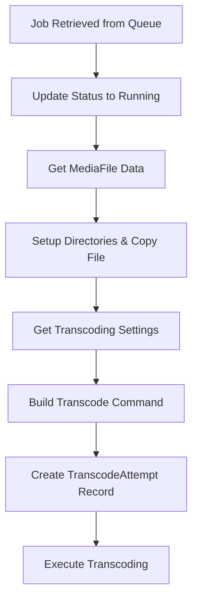
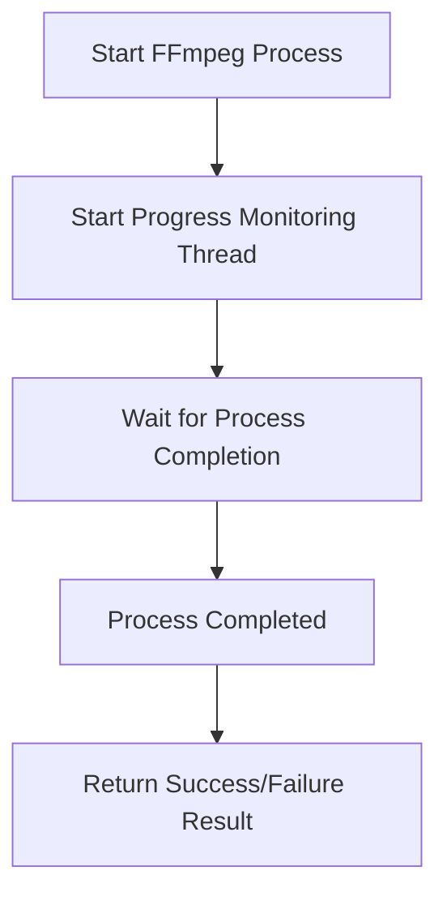
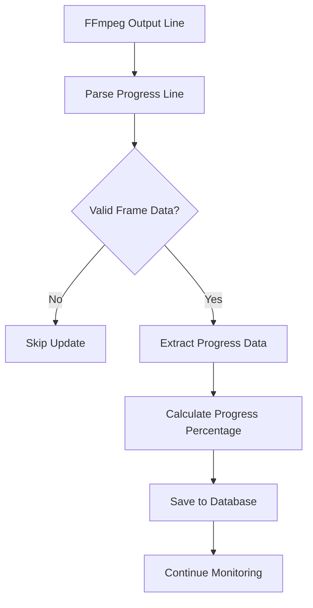

# Transcode Execution Workflow

This document describes the detailed execution workflow for transcoding jobs, including progress tracking, completion handling, and validation logic.

## Overview

The transcode execution workflow handles the actual processing of transcoding jobs from start to completion, including real-time progress monitoring, accurate frame counting, and proper cleanup.

## Key Components

### 1. ProcessTranscodeQueueService
**File**: `Services/ProcessTranscodeQueueService.py`
- **Purpose**: Orchestrates the entire transcoding queue processing
- **Key Methods**:
  - `Run()`: Starts the transcoding queue processing
  - `ProcessJob()`: Handles individual job workflow
  - `ExecuteTranscoding()`: Executes transcoding with progress monitoring
  - `HandleTranscodingResult()`: Processes completion (success/failure)
  - `HandleJobFailure()`: Handles job failures

### 2. VideoTranscodingService
**File**: `Services/VideoTranscodingService.py`
- **Purpose**: Executes FFmpeg commands and monitors progress
- **Key Methods**:
  - `TranscodeVideo()`: Main transcoding execution method
  - `MonitorProgress()`: Monitors FFmpeg output in real-time
  - `ParseProgressLine()`: Parses FFmpeg output lines for progress data

## Execution Flow

### 1. Job Initialization


### 2. Transcoding Execution


### 3. Progress Monitoring


## Progress Tracking Implementation

### Frame Count Extraction
The system extracts the total frame count directly from FFmpeg's initial metadata output:

**FFmpeg Output Example**:
```
NUMBER_OF_FRAMES-eng: 35651
```

**Parsing Logic**:
```python
if "NUMBER_OF_FRAMES" in Line:
    FrameCountMatch = re.search(r'NUMBER_OF_FRAMES[^:]*:\s*(\d+)', Line)
    if FrameCountMatch:
        TotalFrames = int(FrameCountMatch.group(1))
        self._TotalFrameCount = TotalFrames
        return None  # This is metadata, not a progress line
```

### Progress Line Parsing
FFmpeg outputs progress lines in this format:
```
frame= 3337 fps=270 q=39.0 size= 12544KiB time=00:02:13.40 bitrate= 770.3kbits/s speed=10.8x
```

**Parsing Logic**:
```python
# Extract frame number
FrameMatch = re.search(r'frame=\s*(\d+)', Line)
if FrameMatch:
    CurrentFrame = int(FrameMatch.group(1))
    
    # Ignore frame 0 or null values to prevent UI flashing
    if CurrentFrame <= 0:
        return None  # Skip this progress update
    
    ProgressData['CurrentFrame'] = CurrentFrame
```

### Progress Calculation
```python
# Calculate progress percentage using actual frame count
if hasattr(self, '_TotalFrameCount') and self._TotalFrameCount > 0:
    TotalFrames = self._TotalFrameCount
    ProgressData['TotalFrames'] = TotalFrames
    ProgressPercent = (CurrentFrame / TotalFrames) * 100
    
    # Cap at 95% until actually done
    ProgressData['ProgressPercent'] = min(ProgressPercent, 95)
    
    # Calculate ETA based on current FPS and remaining frames
    CurrentFPS = ProgressData.get('CurrentFPS', 0)
    if CurrentFPS > 0 and CurrentFrame > 0:
        RemainingFrames = TotalFrames - CurrentFrame
        if RemainingFrames > 0:
            SecondsRemaining = RemainingFrames / CurrentFPS
            # Convert to HH:MM:SS or MM:SS format
            ProgressData['ETA'] = format_time(SecondsRemaining)
        else:
            ProgressData['ETA'] = "00:00"
    else:
        ProgressData['ETA'] = "Calculating..."
```

## Validation and Error Prevention

### Frame Validation
To prevent UI flashing from temporary frame 0 values:

1. **Frame 0/Null Check**: Ignore any frame values ≤ 0
2. **No Frame Data Check**: Skip updates if no valid frame data is present
3. **Database Protection**: Only valid progress data reaches the database

### Implementation:
```python
# Only proceed if we have valid frame data
if 'CurrentFrame' not in ProgressData:
    return None  # No valid frame data, skip this update
```

## Completion Handling

### Success Completion
When transcoding completes successfully:

1. **Delete TranscodeProgress record** immediately
2. **Check active job count** to determine if processing should continue
3. **Set IsProcessing = False** if no more active jobs
4. **Update TranscodeAttempt** with success details
5. **Add to VMAF queue** for quality assessment

```python
# Clean up progress data for completed job
self.DatabaseManager.DeleteTranscodeProgress(TranscodeAttemptId)

# Mark processing as complete if no more active jobs
activeJobCount = len([thread for thread in self.ActiveJobs if thread.is_alive()])
if activeJobCount == 0:
    self.IsProcessing = False
```

### Failure Completion
When transcoding fails:

1. **Delete TranscodeProgress record** immediately
2. **Check active job count** to determine if processing should continue
3. **Set IsProcessing = False** if no more active jobs
4. **Update TranscodeAttempt** with error details
5. **Log error** for investigation

```python
# Clean up progress data for failed job
if TranscodeAttemptId:
    self.DatabaseManager.DeleteTranscodeProgress(TranscodeAttemptId)

# Mark processing as complete if no more active jobs
activeJobCount = len([thread for thread in self.ActiveJobs if thread.is_alive()])
if activeJobCount == 0:
    self.IsProcessing = False
```

## Real-Time Updates

### Database Updates
- **No Throttling**: Progress updates are saved immediately to the database
- **Real-Time**: UI receives updates as soon as FFmpeg provides new progress data
- **Efficient**: Single record updates instead of multiple inserts

### ETA Calculation
The system calculates accurate ETA (Estimated Time of Arrival) based on:
- **Current Frame**: Current position in the video
- **Total Frames**: Total number of frames (from FFmpeg metadata)
- **Current FPS**: Current frames per second processing rate

**Formula**: `ETA = (TotalFrames - CurrentFrame) / CurrentFPS`

**Display Format**:
- **Hours > 0**: `HH:MM:SS` (e.g., "01:23:45")
- **Hours = 0**: `MM:SS` (e.g., "23:45")
- **Completed**: `00:00`
- **No Data**: `Calculating...`

### UI Display
The Activity tab displays progress in the format:
```
Current Frame / Total Frames
7,462 / 35,651
```

**Implementation**:
```javascript
if (frameElement) {
    const currentFrame = progressData.frame || 0;
    const totalFrames = progressData.totalFrames || 0;
    if (totalFrames > 0) {
        frameElement.textContent = `${currentFrame.toLocaleString()} / ${totalFrames.toLocaleString()}`;
    } else {
        frameElement.textContent = currentFrame.toLocaleString();
    }
}
```

## Error Handling

### FFmpeg Process Errors
- **Return Code Check**: Process return code indicates success (0) or failure (non-zero)
- **Error Output Capture**: FFmpeg stderr is captured and logged on failure
- **Graceful Cleanup**: Process references are cleaned up regardless of outcome

### Progress Parsing Errors
- **Silent Handling**: Parsing errors are handled silently to avoid log spam
- **Graceful Degradation**: Invalid progress lines are ignored without affecting transcoding
- **Validation**: Multiple validation layers prevent bad data from reaching the database

## Performance Optimizations

### Threading
- **Progress Monitoring**: Runs in separate daemon thread
- **Non-Blocking**: Main transcoding process continues while progress is monitored
- **Clean Shutdown**: Threads are properly cleaned up on completion

### Database Efficiency
- **Single Record Updates**: Uses UPDATE on existing TranscodeProgress record
- **Immediate Updates**: No throttling delays for real-time responsiveness
- **Proper Cleanup**: Records are deleted immediately on completion

### Memory Management
- **Process References**: Active processes are tracked and cleaned up
- **Thread Management**: Active threads are tracked and cleaned up
- **Resource Cleanup**: All resources are properly released on completion

## Status Synchronization

### IsProcessing Flag
The `IsProcessing` flag is synchronized with actual job completion:

- **Set to True**: When transcoding starts
- **Set to False**: Immediately when all jobs complete (success or failure)
- **Race Condition Prevention**: Flag is updated before UI polls for status

### UI Status Detection
The UI determines transcoding status by checking:
1. **IsProcessing flag**: Internal service state
2. **TranscodeProgress record**: Database record existence
3. **Both must be consistent**: For transcoding to show as active

## Troubleshooting

### Common Issues

1. **UI Shows "Running" After Completion**
   - **Cause**: Race condition between progress cleanup and IsProcessing flag
   - **Fix**: Set IsProcessing = False immediately on job completion

2. **Progress Flashing to 0%**
   - **Cause**: FFmpeg outputs frame=0 between valid frames
   - **Fix**: Validate frame data and ignore values ≤ 0

3. **Inaccurate Progress Percentage**
   - **Cause**: Using estimated frame counts instead of actual FFmpeg metadata
   - **Fix**: Extract total frame count from FFmpeg's NUMBER_OF_FRAMES output

4. **Stale Progress Records**
   - **Cause**: Progress records not cleaned up on completion
   - **Fix**: Delete TranscodeProgress record immediately on job completion

### Debugging

Enable detailed logging to troubleshoot issues:
- **Progress Parsing**: Log frame extraction and validation
- **Completion Handling**: Log IsProcessing flag changes
- **Database Operations**: Log progress record creation and deletion
- **Thread Management**: Log thread lifecycle events

## Future Improvements

### Potential Enhancements
1. **ETA Calculation**: Use frame rate and remaining frames for accurate ETA
2. **Progress Smoothing**: Average progress over time to reduce UI jitter
3. **Batch Processing**: Handle multiple concurrent jobs more efficiently
4. **Progress Persistence**: Save progress across application restarts
5. **Advanced Validation**: More sophisticated progress data validation

### Monitoring
1. **Performance Metrics**: Track transcoding speed and efficiency
2. **Error Rates**: Monitor failure rates and common error patterns
3. **Resource Usage**: Track CPU, memory, and disk usage during transcoding
4. **Quality Metrics**: Correlate progress with final output quality

This execution workflow ensures reliable, real-time transcoding with accurate progress tracking and proper completion handling.
