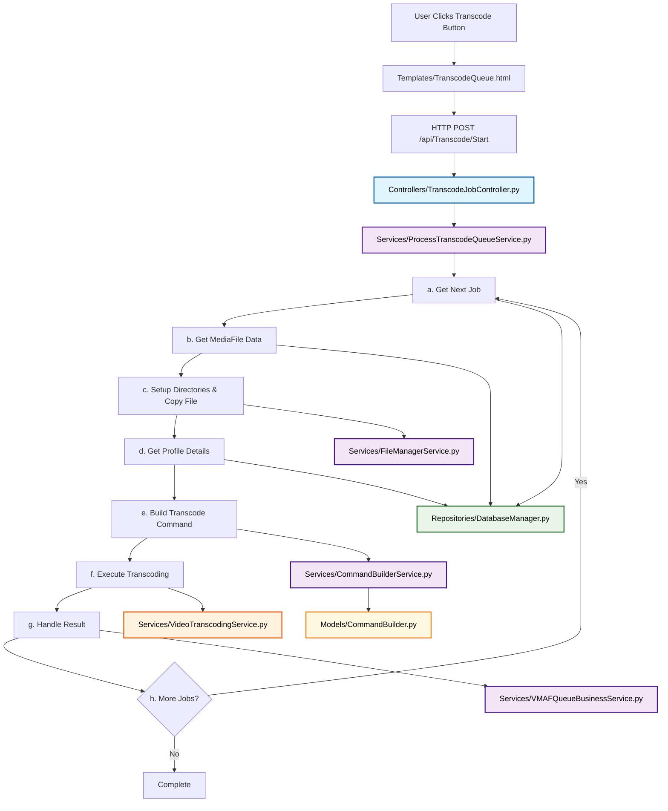

# Transcoding Workflow - Corrected Architecture

This document describes the complete transcoding process using proper MVVM architecture with tool-agnostic naming.

## Architecture Overview

The transcoding workflow follows a clean separation of concerns with proper MVVM layers:

```
Controller → Service → Repository → Tool Service
```

## Complete Workflow

### 1. View (HTTP Interface)
**File**: `Templates/TranscodeQueue.html`
- Button click event triggers JavaScript
- JavaScript makes HTTP POST request to `/api/Transcode/Start`

### 2. Controller Layer
**File**: `Controllers/TranscodeJobController.py`
- Receives HTTP POST request
- **Validates**: `MaxConcurrentJobs` parameter (integer between 1-5)
- **Calls**: `ProcessTranscodeQueueService.Run(MaxConcurrentJobs)`
- **Returns**: JSON response (success/failure)

### 3. Service Layer (Business Logic)
**File**: `Services/ProcessTranscodeQueueService.py` (NEW - needs creation)
- **Run()**: Orchestrates the entire transcoding queue processing
- **ProcessNextJob()**: Handles individual job workflow:
  [x] a. **GetNextJob()** → calls `DatabaseManager.GetNextPendingTranscodeJob()`
  [x] b. **GetMediaFileData()** → calls `DatabaseManager.GetMediaFileByPath(job.FilePath)` to get source resolution
  [x] c. **FilePreparation()** → calls `FileManagerService.SetupTranscodingDirectories()` and `FileManagerService.CopyFile(job.FilePath, destination)`
  [ ] d. **GetTranscodingSettings()** → calls:
     [x] - `DatabaseManager.GetProfileSettingsForTargetResolution(job.AssignedProfile, MediaFile.Resolution)` (includes TranscodeDownTo logic)
     [x] - `DatabaseManager.GetCodecFlagsByCodecName()`
     [x] - `DatabaseManager.GetCodecParametersByCodecFlagsId()`
  [ ] e. **BuildTranscodeCommand()** → calls `CommandBuilderService.BuildCommand()`
  [ ] f. **ExecuteTranscoding()** → calls `VideoTranscodingService.TranscodeVideo()` with progress callback that calls `DatabaseManager.SaveTranscodeProgress()`
  [ ] g. **HandleTranscodingResult()** → calls `ProcessTranscodeQueueService.HandleTranscodingResult()` (internal method)
  [ ] h. **CleanupOrContinue()** → calls `ProcessTranscodeQueueService.CleanupOrContinue()` (internal method)
- **ApplyProfileSettings()**: Maps profile settings to command parameters

**File**: `Services/CommandBuilderService.py` (NEW - needs creation)
- **BuildCommand()**: Orchestrates command building by:
  [ ] a. Getting job data from previous steps
  [ ] b. Getting profile settings, codec flags, and codec parameters
  [ ] c. Calling `CommandBuilder.BuildCommand()` (Model) for pure transformation
  [ ] d. Returning complete transcoding command string
- **Resolution Scaling**: Uses `ResolutionService` to calculate target resolution and FFmpeg scale filter

**File**: `Models/CommandBuilder.py` (NEW - needs creation)
- [ ] **BuildCommand()**: Pure data transformation function
- [ ] **Input**: Job data, profile settings, codec flags, codec parameters, target resolution
- [ ] **Output**: Complete transcoding command string with resolution scaling
- [ ] **Resolution Scaling**: Adds `-vf scale=WIDTH:HEIGHT` filter when TranscodeDownTo is set
- [ ] **No external dependencies**: Pure function

**File**: `Services/FileManagerService.py` (EXISTING - called by TranscodeCommandBuilderService)
- [x] **SetupTranscodingDirectories()**: Creates `C:\MediaVortex\Source` and `C:\MediaVortex` directories
- [x] **CopyFile(SourcePath, DestinationPath)**: Copies source file from job.FilePath to `C:\MediaVortex\Source`
- [x] **On Success**: Proceeds to business logic
- [x] **On Failure**: Removes item from queue, gets next job

### 4. Repository Layer (Data Access)
**File**: `Repositories/DatabaseManager.py`
- [x] **GetNextPendingTranscodeJob()**: Gets next job from TranscodeQueue table
- [x] **GetProfileSettingsForTargetResolution()**: Gets transcoding settings from ProfileThresholds table
- [x] **GetCodecFlagsByCodecName()**: Gets codec configuration from CodecFlags table
- [x] **GetCodecParametersByCodecFlagsId()**: Gets transcoding parameters from CodecParameters table
- [x] **GetMediaFileByPath()**: Gets MediaFile data by FilePath to retrieve source resolution
- [x] **SaveTranscodeAttempt()**: Saves attempt record
- [x] **SaveTranscodeProgress()**: Saves/updates progress tracking during transcoding
- [ ] **UpdateJobStatus()**: Updates job status in queue

**File**: `Services/ResolutionService.py` (EXISTING - used by CommandBuilder)
- [x] **StandardizeResolution()**: Converts resolution strings to standard format
- [x] **GetStandardHeight()**: Gets standard height for resolution
- [x] **CalculateStandardWidth()**: Calculates width maintaining aspect ratio
- [x] **FindMatchingThreshold()**: Finds matching profile threshold for resolution

### 5. Tool Service (Execution)
**File**: `Services/VideoTranscodingService.py` (RENAMED from FFmpegService.py - needs implementation)
- [ ] **TranscodeVideo()**: Executes actual transcoding command with progress tracking
- [ ] **Progress Callback**: Calls `DatabaseManager.SaveTranscodeProgress()` for real-time updates
- [ ] **Parameters**: TranscodeAttemptId, CurrentPhase, ProgressPercent, CurrentFrame, CurrentFPS, CurrentBitrate, CurrentTime, CurrentSpeed, ETA, TotalFrames, AverageFPS
- [ ] **Returns**: Success/failure, output file path, duration, error details

**File**: `Services/ProcessTranscodeQueueService.py` (NEW - needs creation)
- [ ] **Run()**: Orchestrates the entire transcoding queue processing
- [ ] **ProcessNextJob()**: Handles individual job workflow (steps a-g)
- [ ] **HandleTranscodingResult()**: Processes transcoding results by:
  [ ] a. **On Success**: Updates job status, saves attempt record, adds to VMAF queue for quality assessment
  [ ] b. **On Failure**: Updates job status, logs error, marks for retry or removal
- [ ] **CleanupOrContinue()**: Determines next action by:
  [ ] a. **If more jobs**: Calls `ProcessNextJob()` to continue processing
  [ ] b. **If queue empty**: Stops processing and returns completion status

## Implementation Status

### Missing Files (Need Implementation)
1. [ ] `Services/ProcessTranscodeQueueService.py` (NEW - needs creation)
2. [ ] `Services/CommandBuilderService.py` (NEW - needs creation)
3. [ ] `Models/CommandBuilder.py` (NEW - needs creation)
4. [ ] `Services/VideoTranscodingService.py` (RENAMED from FFmpegService.py - needs implementation)

### Files to Remove (Conflicting Architecture)
- [ ] `ViewModels/TranscodingViewModel.py` (business logic should be in Service)
- [ ] `ViewModels/ActivityViewModel.py` (redundant wrapper)
- [ ] `Services/HandBrakeTranscodingService.py` (consolidate into VideoTranscodingService)

## Key Principles

1. **Tool-Agnostic Naming**: All services named by business capability, not implementation tool
2. **Single Responsibility**: Each layer has one clear responsibility
3. **Proper MVVM**: Clear separation between Controller, Service, Repository, and Tool layers
4. **Correct Order**: Command must be built before execution
5. **No Code Duplication**: Single transcoding service, single command builder

## Complete Flow Diagram



## Data Flow

a. **Get job from queue** → DatabaseManager
b. **Get MediaFile data** → DatabaseManager (to retrieve source resolution)
c. **Setup directories & copy file** → FileManagerService
d. **Get profile details** → DatabaseManager (with TranscodeDownTo logic)
e. **Build transcoding command** → CommandBuilderService → CommandBuilder (Model)
f. **Execute transcoding** → VideoTranscodingService (with real-time progress tracking)
g. **Handle transcoding result** → ProcessTranscodeQueue (success/failure processing + VMAF queue)
h. **Continue or complete** → ProcessTranscodeQueue (queue management)

This architecture eliminates the complex 12-step process and replaces it with a clean, maintainable 4-step workflow that follows proper MVVM principles.
