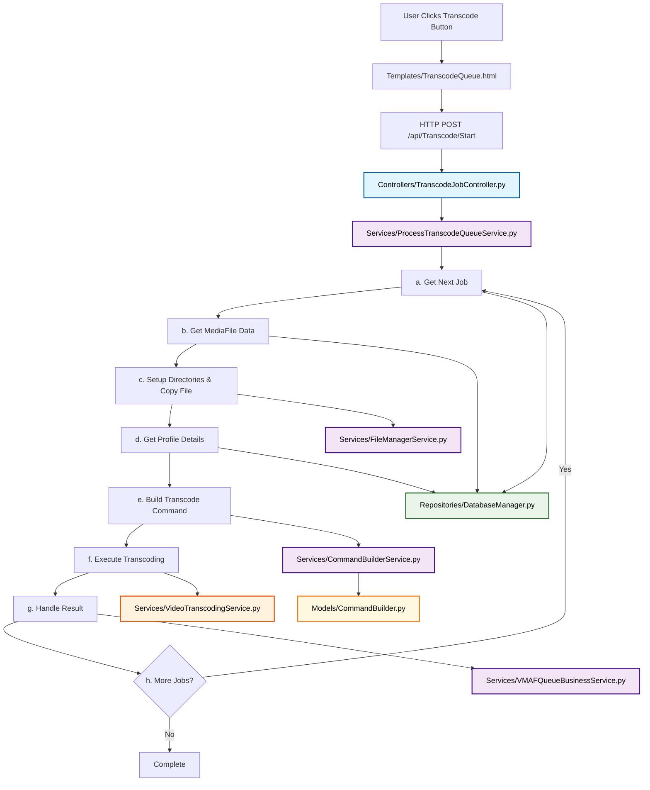

# Transcoding Workflow - Corrected Architecture

This document describes the complete transcoding process using proper MVVM architecture with tool-agnostic naming.

## Architecture Overview

The transcoding workflow follows a clean separation of concerns with proper MVVM layers:

```
Controller → Service → Repository → Tool Service
```

## Complete Workflow

### 1. View (HTTP Interface)
**File**: `Templates/TranscodeQueue.html`
- Button click event triggers JavaScript
- JavaScript makes HTTP POST request to `/api/Transcode/Start`

### 2. Controller Layer
**File**: `Controllers/TranscodeJobController.py`
- Receives HTTP POST request
- **Validates**: `MaxConcurrentJobs` parameter (integer between 1-5)
- **Calls**: `ProcessTranscodeQueueService.Run(MaxConcurrentJobs)`
- **Returns**: JSON response (success/failure)

### 3. Service Layer (Business Logic)
**File**: `Services/ProcessTranscodeQueueService.py` (NEW - needs creation)
- **Run()**: Orchestrates the entire transcoding queue processing
- **ProcessNextJob()**: Handles individual job workflow:
  [x] a. **GetNextJob()** → `Repositories/DatabaseManager.py` → `GetNextPendingTranscodeJob()`
  [x] b. **GetMediaFileData()** → `Repositories/DatabaseManager.py` → `GetMediaFileByPath(job.FilePath)` to get source resolution
  [x] c. **FilePreparation()** → `Services/TranscodingFileManagerService.py` → `SetupTranscodingDirectories()` and `CopyFile(job.FilePath, destination)`
  [x] d. **GetTranscodingSettings()** → `Repositories/DatabaseManager.py` → calls:
     [x] - `GetProfileSettingsForTargetResolution(job.AssignedProfile, MediaFile.Resolution)` (includes TranscodeDownTo logic)
     [x] - `GetCodecFlagsByCodecName()`
     [x] - `GetCodecParametersByCodecFlagsId()`
  [x] e. **BuildTranscodeCommand()** → `Services/CommandBuilderService.py` → `BuildCommand()`
  [x] f. **ExecuteTranscoding()** → `Services/VideoTranscodingService.py` → `TranscodeVideo()` with progress callback that calls `Repositories/DatabaseManager.py` → `SaveTranscodeProgress()`
  [x] g. **HandleTranscodingResult()** → `Services/ProcessTranscodeQueueService.py` → `_HandleTranscodingResult()` (internal method)
  [x] h. **CleanupOrContinue()** → `Services/ProcessTranscodeQueueService.py` → `_CleanupOrContinue()` (internal method)
- **ApplyProfileSettings()**: Maps profile settings to command parameters

**File**: `Services/CommandBuilderService.py` (CREATED)
- **BuildCommand()**: Orchestrates command building by:
  [x] a. Getting job data from previous steps
  [x] b. Getting profile settings, codec flags, and codec parameters
  [x] c. Calling `Models/CommandBuilder.py` → `BuildCommand()` (Model) for pure transformation
  [x] d. Returning complete transcoding command string
- **Resolution Scaling**: Uses `Services/ResolutionService.py` → `StandardizeResolution()`, `GetStandardHeight()`, `CalculateStandardWidth()` to calculate target resolution and FFmpeg scale filter

**File**: `Models/CommandBuilder.py` (CREATED)
- [x] **BuildCommand()**: Pure data transformation function
- [x] **Input**: Job data, profile settings, codec flags, codec parameters, target resolution
- [x] **Output**: Complete transcoding command string with resolution scaling
- [x] **Resolution Scaling**: Adds `-vf scale=WIDTH:HEIGHT` filter when TranscodeDownTo is set
- [x] **No external dependencies**: Pure function

**File**: `Services/TranscodingFileManagerService.py` (CREATED - minimal file operations for transcoding)
- [x] **SetupTranscodingDirectories()**: Creates `C:\MediaVortex\Source` and `C:\MediaVortex` directories
- [x] **CopyFile(SourcePath, DestinationPath)**: Copies source file from job.FilePath to `C:\MediaVortex\Source`
- [x] **On Success**: Proceeds to business logic
- [x] **On Failure**: Removes item from queue, gets next job

### 4. Repository Layer (Data Access)
**File**: `Repositories/DatabaseManager.py`
- [x] **GetNextPendingTranscodeJob()**: Gets next job from TranscodeQueue table
- [x] **GetProfileSettingsForTargetResolution()**: Gets transcoding settings from ProfileThresholds table
- [x] **GetCodecFlagsByCodecName()**: Gets codec configuration from CodecFlags table
- [x] **GetCodecParametersByCodecFlagsId()**: Gets transcoding parameters from CodecParameters table
- [x] **GetMediaFileByPath()**: Gets MediaFile data by FilePath to retrieve source resolution
- [x] **SaveTranscodeAttempt()**: Saves attempt record
- [x] **SaveTranscodeProgress()**: Saves/updates progress tracking during transcoding
- [x] **DeleteTranscodeQueueItem()**: Removes completed job from TranscodeQueue

**File**: `Services/ResolutionService.py` (EXISTING - used by CommandBuilder)
- [x] **StandardizeResolution()**: Converts resolution strings to standard format
- [x] **GetStandardHeight()**: Gets standard height for resolution
- [x] **CalculateStandardWidth()**: Calculates width maintaining aspect ratio
- [x] **FindMatchingThreshold()**: Finds matching profile threshold for resolution

### 5. Tool Service (Execution)
**File**: `Services/VideoTranscodingService.py` (CREATED)
- [x] **TranscodeVideo()**: Executes actual transcoding command with progress tracking
- [x] **Progress Callback**: Calls `Repositories/DatabaseManager.py` → `SaveTranscodeProgress()` for real-time updates
- [x] **Parameters**: TranscodeAttemptId, CurrentPhase, ProgressPercent, CurrentFrame, CurrentFPS, CurrentBitrate, CurrentTime, CurrentSpeed, ETA, TotalFrames, AverageFPS
- [x] **Returns**: Success/failure, output file path, duration, error details

**File**: `Services/ProcessTranscodeQueueService.py` (CREATED)
- [x] **Run()**: Orchestrates the entire transcoding queue processing
- [x] **ProcessNextJob()**: Handles individual job workflow (steps a-g)
- [x] **HandleTranscodingResult()**: Processes transcoding results by:
  [x] a. **On Success**: Calls `Repositories/DatabaseManager.py` → `DeleteTranscodeQueueItem()`, saves attempt record, adds to VMAF queue for quality assessment
  [x] b. **On Failure**: Calls `Repositories/DatabaseManager.py` → `DeleteTranscodeQueueItem()`, logs error, saves attempt record for investigation
- [x] **CleanupOrContinue()**: Determines next action by:
  [x] a. **If more jobs**: Calls `ProcessNextJob()` to continue processing
  [x] b. **If queue empty**: Stops processing and returns completion status

## Implementation Status

### ✅ Completed Files
1. [x] `Services/ProcessTranscodeQueueService.py` (CREATED)
2. [x] `Services/CommandBuilderService.py` (CREATED)
3. [x] `Models/CommandBuilder.py` (CREATED)
4. [x] `Services/VideoTranscodingService.py` (CREATED)
5. [x] `Services/TranscodingFileManagerService.py` (CREATED - minimal file operations, no FFmpeg dependencies)
6. [x] `Services/TranscodingVMAFQueueService.py` (CREATED - minimal VMAF queue, no FFmpeg dependencies)
7. [x] `ViewModels/TranscodingViewModel.py` (CREATED - maintains controller contract for starting transcoding)
8. [x] `ViewModels/ActivityViewModel.py` (CREATED - maintains controller contract for progress updates)

### Required ViewModels (Controller Contract)
- [x] `ViewModels/TranscodingViewModel.py` - Required because `Controllers/TranscodeJobController.py` imports and uses it to start transcoding
- [x] `ViewModels/ActivityViewModel.py` - Required because `Controllers/TranscodeJobController.py` imports and uses it for progress updates

### Files to Remove (Conflicting Architecture)
- [ ] `Services/HandBrakeTranscodingService.py` (consolidate into VideoTranscodingService)

## Database Usage Pattern

### TranscodeQueue - Temporary Work Queue
- **Purpose**: Temporary holding place for jobs waiting to be processed
- **Lifecycle**: Add → Process → **DELETE** (not update)
- **Usage**: Simple "to-do list" that gets cleaned up after processing

### TranscodeProgress - Real-time Tracking
- **Purpose**: Real-time progress tracking during active transcoding
- **Lifecycle**: Create once → Update repeatedly → Keep for history
- **Usage**: Single record per job, updated with progress data during transcoding

### TranscodeAttempts - Historical Record
- **Purpose**: Permanent record of what happened to each job
- **Lifecycle**: Create once when job completes → Keep forever
- **Usage**: Audit trail and historical analysis

## Key Principles

1. **Tool-Agnostic Naming**: All services named by business capability, not implementation tool
2. **Single Responsibility**: Each layer has one clear responsibility
3. **Proper MVVM**: Clear separation between Controller, Service, Repository, and Tool layers
4. **Correct Order**: Command must be built before execution
5. **No Code Duplication**: Single transcoding service, single command builder
6. **Correct Database Usage**: Queue for temporary work, Progress for real-time tracking, Attempts for history
7. **Decoupled Architecture**: Transcoding workflow is independent of FFmpeg analysis services

## Complete Flow Diagram



## Data Flow

a. **Get job from queue** → `Repositories/DatabaseManager.py` → `GetNextPendingTranscodeJob()` (TranscodeQueue)
b. **Get MediaFile data** → `Repositories/DatabaseManager.py` → `GetMediaFileByPath()` (to retrieve source resolution)
c. **Setup directories & copy file** → `Services/TranscodingFileManagerService.py` → `SetupTranscodingDirectories()` & `CopyFile()`
d. **Get profile details** → `Repositories/DatabaseManager.py` → `GetProfileSettingsForTargetResolution()`, `GetCodecFlagsByCodecName()`, `GetCodecParametersByCodecFlagsId()` (with TranscodeDownTo logic)
e. **Build transcoding command** → `Services/CommandBuilderService.py` → `BuildCommand()` → `Models/CommandBuilder.py` → `BuildCommand()`
f. **Execute transcoding** → `Services/VideoTranscodingService.py` → `TranscodeVideo()` (with real-time progress tracking to TranscodeProgress via `Repositories/DatabaseManager.py` → `SaveTranscodeProgress()`)
g. **Handle transcoding result** → `Services/ProcessTranscodeQueueService.py` → `_HandleTranscodingResult()` (delete from queue via `Repositories/DatabaseManager.py` → `DeleteTranscodeQueueItem()`, save to TranscodeAttempts, add to VMAF queue)
h. **Continue or complete** → `Services/ProcessTranscodeQueueService.py` → `_CleanupOrContinue()` (queue management)

This architecture eliminates the complex 12-step process and replaces it with a clean, maintainable 4-step workflow that follows proper MVVM principles.
