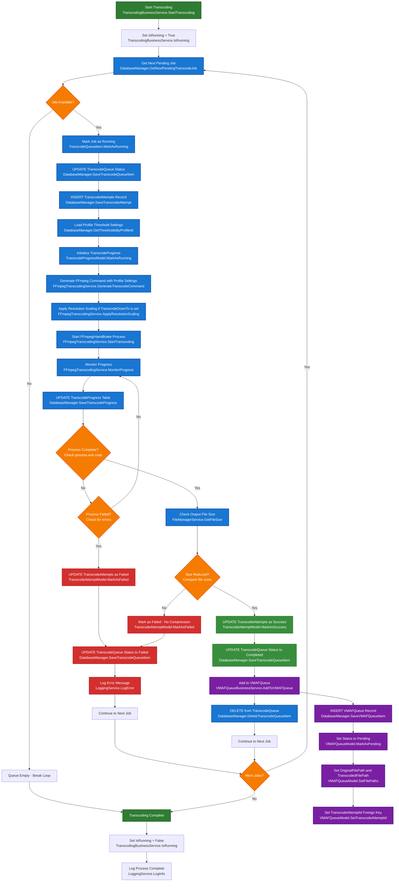

# Transcoding Workflow

This diagram shows the complete transcoding process from queue pickup to VMAF queue population.

## Key Components

### Database Tables Updated:
- **TranscodeQueue**: Status changes (Pending → Running → Completed/Failed)
- **TranscodeAttempts**: Success/failure tracking with compression details
- **TranscodeProgress**: Real-time progress updates during transcoding
- **VMAFQueue**: New records created for successful transcodes
- **ProfileThresholds**: Loaded to determine transcoding parameters

### Key Functions Used:
- **DatabaseManager.GetThresholdsByProfileId()**: Loads profile threshold settings for the assigned profile
- **FFmpegTranscodingService.GenerateTranscodeCommand()**: Creates base FFmpeg command with profile settings (bitrate, codec, quality)
- **FFmpegTranscodingService.ApplyResolutionScaling()**: Adds resolution scaling filters when TranscodeDownTo is set
- **FFmpegTranscodingService.StartTranscoding()**: Executes the complete FFmpeg command with all settings applied

### Key Decision Points:
1. **Job Availability**: Check for pending jobs in queue
2. **Process Completion**: Monitor FFmpeg/HandBrake process
3. **Size Reduction**: Verify file was actually compressed
4. **VMAF Queue Addition**: Only add successful compressions

### Success Criteria:
- Transcoding process completes without errors
- Output file is smaller than input file
- VMAFQueue record created with proper file paths

### Error Handling:
- Failed transcodes marked in TranscodeAttempts
- TranscodeQueue status updated to Failed
- Error messages logged for debugging
- Process continues to next job

### IsRunning Flag Management:
- **Start**: `IsRunning = True` when transcoding begins
- **During Processing**: Flag prevents multiple concurrent transcoding processes
- **Completion**: `IsRunning = False` in `finally` block ensures flag is always reset
- **Failure Recovery**: Flag reset on both success and failure paths
- **Prevents**: "Already transcoding" errors from stuck flags

### VMAF Integration:
- Successful transcodes automatically added to VMAFQueue
- Foreign key relationship maintained via TranscodeAttemptId
- Original and transcoded file paths preserved for quality testing

### Profile Threshold Processing:
- **Step G1**: Load profile thresholds for the file's assigned profile
  - Retrieves VideoBitrateKbps, AudioBitrateKbps, Codec, Quality, Grain settings
  - Determines if TranscodeDownTo field is set (e.g., 2160p → 720p)
- **Step I**: Generate base FFmpeg command using profile settings
  - Applies bitrate limits: `-maxrate {VideoBitrateKbps}k -bufsize {VideoBitrateKbps*2}k`
  - Sets codec: `-c:v {Codec}` (e.g., libx265)
  - Sets quality: `-crf {Quality}` (e.g., 25)
  - Sets audio bitrate: `-b:a {AudioBitrateKbps}k`
- **Step I1**: Apply resolution scaling if needed
  - Checks TranscodeDownTo field in profile thresholds
  - Adds scaling filter: `-vf scale=1280:720` for 2160p → 720p
  - Ensures proper aspect ratio maintenance
- **Step I2**: Execute complete command with all settings applied

### Resolution Scaling Logic:
- **2160p → 720p**: `-vf scale=1280:720`
- **1080p → 720p**: `-vf scale=1280:720` 
- **720p → 480p**: `-vf scale=854:480`
- **No scaling**: When TranscodeDownTo is null/empty

