# Transcoding Workflow

This diagram shows the complete transcoding process from queue pickup to VMAF queue population.

```mermaid
flowchart TD
    A[Start Transcoding<br/>TranscodingBusinessService.StartTranscoding] --> A1[Set IsRunning = True<br/>TranscodingBusinessService.IsRunning]
    A1 --> B[Get Next Pending Job<br/>DatabaseManager.GetNextPendingTranscodeJob]
    B --> C{Job Available?}
    C -->|No| D[Queue Empty - Break Loop]
    D --> AA[Transcoding Complete]
    C -->|Yes| E[Mark Job as Running<br/>TranscodeQueueItem.MarkAsRunning]
    E --> F[UPDATE TranscodeQueue Status<br/>DatabaseManager.SaveTranscodeQueueItem]
    F -->     G[INSERT TranscodeAttempts Record<br/>DatabaseManager.SaveTranscodeAttempt]
    G --> G1[Get Profile Threshold for File<br/>TranscodingBusinessService.GetProfileThresholdForFile]
    G1 --> G1A[Standardize File Resolution<br/>ResolutionService.StandardizeResolution]
    G1A --> G1B[Find Matching Profile Threshold<br/>ResolutionService.FindMatchingThreshold]
    G1B --> G1C[Load Profile Settings for Target Resolution<br/>DatabaseManager.GetProfileSettingsForTargetResolution]
    G1C --> H[Initialize TranscodeProgress<br/>TranscodeProgressModel.MarkAsRunning]
    H --> I[Generate FFmpeg Command with Profile Settings<br/>FFmpegTranscodingService.BuildFFmpegCommand]
    I --> I1[Apply Resolution Scaling if TranscodeDownTo is set<br/>FFmpegTranscodingService.GetScaleFilter]
    I1 --> I2[Start FFmpeg/HandBrake Process<br/>FFmpegTranscodingService.TranscodeVideo]
    I2 --> J[Monitor Progress<br/>FFmpegTranscodingService.MonitorProgress]
    J --> K[UPDATE TranscodeProgress Table<br/>DatabaseManager.SaveTranscodeProgress]
    K --> L{Process Complete?<br/>Check process exit code}
    L -->|No| M{Process Failed?<br/>Check for errors}
    M -->|No| J
    M -->|Yes| N[UPDATE TranscodeAttempts as Failed<br/>TranscodeAttemptModel.MarkAsFailed]
    N --> O[UPDATE TranscodeQueue Status to Failed<br/>DatabaseManager.SaveTranscodeQueueItem]
    O --> P[Log Error Message<br/>LoggingService.LogError]
    P --> Q[Continue to Next Job]
    L -->|Yes| R[Check Output File Size<br/>FileManagerService.GetFileSize]
    R --> S{Size Reduced?<br/>Compare file sizes}
    S -->|No| T[Mark as Failed - No Compression<br/>TranscodeAttemptModel.MarkAsFailed]
    T --> O
    S -->|Yes| U[UPDATE TranscodeAttempts as Success<br/>TranscodeAttemptModel.MarkAsSuccess]
    U --> V[UPDATE TranscodeQueue Status to Completed<br/>DatabaseManager.SaveTranscodeQueueItem]
    V --> W[Add to VMAFQueue<br/>VMAFQueueBusinessService.AddToVMAFQueue]
    W --> W5[VMAF Quality Analysis<br/>VMAFQueueBusinessService.ProcessVMAFQueue]
    W5 --> W6{VMAF Score > 90?}
    W6 -->|No| W7[Delete Transcoded File<br/>FileManagerService.DeleteFile]
    W7 --> X[DELETE from TranscodeQueue<br/>DatabaseManager.DeleteTranscodeQueueItem]
    W6 -->|Yes| W8[Delete Original File from Source Location<br/>FileManagerService.DeleteFile]
    W8 --> W9[Move Transcoded File to Original Source Directory<br/>FileManagerService.MoveFile]
    W9 --> W10[Delete Temporary Source File<br/>FileManagerService.DeleteFile]
    W10 --> W11[UPDATE MediaFiles with New File Information<br/>FFmpegService.ExtractMetadata + DatabaseManager.UpdateMediaFile]
    W11 --> X
    X --> Y[Continue to Next Job]
    Q --> Z{More Jobs?}
    Y --> Z
    Z -->|Yes| B
    Z -->|No| AA[Transcoding Complete]
    AA --> AA1[Set IsRunning = False<br/>TranscodingBusinessService.IsRunning]
    AA1 --> AA2[Log Process Complete<br/>LoggingService.LogInfo]
    
    %% VMAF Queue Addition Detail
    W --> W1[INSERT VMAFQueue Record<br/>DatabaseManager.SaveVMAFQueueItem]
    W1 --> W2[Set Status to Pending<br/>VMAFQueueModel.MarkAsPending]
    W2 --> W3[Set OriginalFilePath and TranscodedFilePath<br/>VMAFQueueModel.SetFilePaths]
    W3 --> W4[Set TranscodeAttemptId Foreign Key<br/>VMAFQueueModel.SetTranscodeAttemptId]
    
    %% Styling with dark text
    classDef startEnd fill:#2e7d32,stroke:#1b5e20,stroke-width:2px,color:#ffffff
    classDef process fill:#1976d2,stroke:#0d47a1,stroke-width:2px,color:#ffffff
    classDef decision fill:#f57c00,stroke:#e65100,stroke-width:2px,color:#ffffff
    classDef success fill:#388e3c,stroke:#2e7d32,stroke-width:2px,color:#ffffff
    classDef error fill:#d32f2f,stroke:#b71c1c,stroke-width:2px,color:#ffffff
    classDef vmaf fill:#7b1fa2,stroke:#4a148c,stroke-width:2px,color:#ffffff
    
    class A,AA startEnd
    class B,E,F,G,G1,G1A,G1B,G1C,H,I,I1,I2,J,K,R,U,V,X,W1,W2,W3,W4,W5,W8,W9,W10,W11 process
    class C,L,M,S,Z,W6 decision
    class U,V,W8,W9,W10,W11 success
    class N,O,P,T,W7 error
    class W,W1,W2,W3,W4,W5 vmaf
```

## Key Components

### Database Tables Updated:
- **TranscodeQueue**: Status changes (Pending → Running → Completed/Failed)
- **TranscodeAttempts**: Success/failure tracking with compression details
- **TranscodeProgress**: Real-time progress updates during transcoding
- **VMAFQueue**: New records created for successful transcodes
- **ProfileThresholds**: Loaded to determine transcoding parameters

### Key Functions Used:
- **TranscodingBusinessService.GetProfileThresholdForFile()**: Gets the appropriate profile threshold for a file using resolution standardization
- **ResolutionService.StandardizeResolution()**: Converts any resolution format (e.g., '1920x1080') to standard format (e.g., '1080p')
- **ResolutionService.FindMatchingThreshold()**: Finds profile threshold that matches the standardized file resolution
- **DatabaseManager.GetThresholdsByProfileId()**: Loads profile threshold settings for the assigned profile
- **DatabaseManager.GetProfileSettingsForTargetResolution()**: Retrieves transcoding settings based on TranscodeDownTo field
- **FFmpegTranscodingService.BuildFFmpegCommand()**: Creates single-pass FFmpeg command with profile settings and resolution scaling
- **FFmpegTranscodingService.BuildFFmpegMultiPassCommand()**: Creates multi-pass FFmpeg command with profile settings and resolution scaling
- **FFmpegTranscodingService.GetScaleFilter()**: Generates appropriate scaling filters for target resolutions
- **FFmpegTranscodingService.TranscodeVideo()**: Executes the complete FFmpeg command with all settings applied
- **VMAFQueueBusinessService.ProcessVMAFQueue()**: Processes VMAF quality analysis on transcoded files
- **FileManagerService.MoveFile()**: Moves transcoded file to original location after quality check passes
- **FileManagerService.DeleteFile()**: Deletes original file after successful replacement
- **FFmpegService.ExtractMetadata()**: Extracts new file metadata from transcoded file
- **DatabaseManager.UpdateMediaFile()**: Updates MediaFiles table with new file information

### Key Decision Points:
1. **Job Availability**: Check for pending jobs in queue
2. **Process Completion**: Monitor FFmpeg/HandBrake process
3. **Size Reduction**: Verify file was actually compressed
4. **VMAF Queue Addition**: Only add successful compressions
5. **VMAF Quality Check**: Verify transcoded file meets quality threshold (>90 VMAF score)

### Success Criteria:
- Transcoding process completes without errors
- Output file is smaller than input file
- VMAFQueue record created with proper file paths
- VMAF quality score exceeds 90 threshold
- Transcoded file successfully replaces original file
- MediaFiles table updated with new file information

### Error Handling:
- Failed transcodes marked in TranscodeAttempts
- TranscodeQueue status updated to Failed
- Error messages logged for debugging
- Process continues to next job
- Low VMAF quality scores result in transcoded file deletion
- File replacement failures are logged and handled gracefully

### IsRunning Flag Management:
- **Start**: `IsRunning = True` when transcoding begins
- **During Processing**: Flag prevents multiple concurrent transcoding processes
- **Completion**: `IsRunning = False` in `finally` block ensures flag is always reset
- **Failure Recovery**: Flag reset on both success and failure paths
- **Prevents**: "Already transcoding" errors from stuck flags

### VMAF Integration:
- Successful transcodes automatically added to VMAFQueue
- Foreign key relationship maintained via TranscodeAttemptId
- Original and transcoded file paths preserved for quality testing
- VMAF quality analysis determines if transcoded file meets quality standards
- Only files with VMAF score > 90 are allowed to replace original files

### MediaFiles Update Process:
- **Step W8**: Delete original file from source location (using filepath from MediaFiles table)
- **Step W9**: Move transcoded file from temporary location to original source directory (may have different filename)
- **Step W10**: Delete temporary source file from C:\MediaVortex\Source
- **Step W11**: Update MediaFiles table with new file information after successful file replacement
  - Extract metadata from transcoded file using FFmpegService.ExtractMetadata()
  - Update file size, resolution, bitrate, codec, and other technical details
  - Update LastScannedDate to reflect the transcoding completion
  - Preserve original file information in TranscodeAttempts table for historical tracking
  - Ensure MediaFiles table always reflects the actual file that exists in the file system

### Resolution Standardization Process:
- **Step G1**: Get profile threshold for the file using resolution standardization
  - Calls `TranscodingBusinessService.GetProfileThresholdForFile()` to find appropriate threshold
  - Uses `ResolutionService.StandardizeResolution()` to convert file resolution to standard format
  - Handles non-standard resolutions (e.g., '1920x1080' → '1080p', '1280x720' → '720p')
  - Skips ultra-wide/VR content that should not be transcoded
- **Step G1A**: Standardize the file's resolution string
  - Converts pixel dimensions to standard resolution names
  - Maintains aspect ratio when rounding down to nearest standard height
  - Returns 'SKIP' for ultra-wide or VR formats
- **Step G1B**: Find matching profile threshold using standardized resolution
  - Compares standardized file resolution against profile threshold resolutions
  - Ensures consistent matching regardless of resolution format variations
  - Returns the appropriate threshold for transcoding settings

### Profile Threshold Processing:
- **Step G1C**: Load profile settings for the target resolution
  - Retrieves VideoBitrateKbps, AudioBitrateKbps, Codec, Quality, Grain settings
  - Determines if TranscodeDownTo field is set (e.g., 2160p → 720p)
- **Step I**: Generate base FFmpeg command using profile settings
  - Applies bitrate limits: `-maxrate {VideoBitrateKbps}k -bufsize {VideoBitrateKbps*2}k`
  - Sets codec: `-c:v {Codec}` (e.g., libx265)
  - Sets quality: `-crf {Quality}` (e.g., 25)
  - Sets audio bitrate: `-b:a {AudioBitrateKbps}k`
- **Step I1**: Apply resolution scaling if needed
  - Checks TranscodeDownTo field in profile thresholds
  - Adds scaling filter: `-vf scale=1280:720` for 2160p → 720p
  - Ensures proper aspect ratio maintenance
- **Step I2**: Execute complete command with all settings applied

### TranscodeDownTo Feature Implementation:
The TranscodeDownTo feature allows users to downscale videos to lower resolutions during transcoding. This feature is fully implemented for both single-pass and multi-pass transcoding.

#### Database Processing:
- **GetProfileSettingsForTargetResolution()**: Retrieves transcoding settings based on the TranscodeDownTo field
  - Queries ProfileThresholds table for TranscodeDownTo value
  - Returns settings for the target resolution (e.g., 720p settings when TranscodeDownTo = "720p")
  - Handles "No downscaling" case by using source resolution settings

#### FFmpeg Command Building:
- **Single-Pass Commands**: `BuildFFmpegCommand()` now includes resolution scaling
  - Checks if TargetResolution is set and not 'original'
  - Calls `GetScaleFilter()` to generate appropriate scaling filter
  - Adds `-vf` and scaling filter to FFmpeg command
- **Multi-Pass Commands**: `BuildFFmpegMultiPassCommand()` includes resolution scaling in Pass 2
  - Same scaling logic applied to encoding pass
  - Pass 1 (analysis) does not include scaling filters

#### Resolution Scaling Logic:
- **2160p → 720p**: `-vf scale=1280:720:force_original_aspect_ratio=decrease,pad=1280:720:(ow-iw)/2:(oh-ih)/2`
- **1080p → 720p**: `-vf scale=1280:720:force_original_aspect_ratio=decrease,pad=1280:720:(ow-iw)/2:(oh-ih)/2`
- **1080p → 1080p**: `-vf scale=1920:1080:force_original_aspect_ratio=decrease,pad=1920:1080:(ow-iw)/2:(oh-ih)/2`
- **720p → 480p**: `-vf scale=854:480:force_original_aspect_ratio=decrease,pad=854:480:(ow-iw)/2:(oh-ih)/2`
- **No scaling**: When TranscodeDownTo is null/empty or set to "No downscaling"

#### Aspect Ratio Maintenance:
- Uses `force_original_aspect_ratio=decrease` to maintain proper aspect ratios
- Adds padding with `pad=WIDTH:HEIGHT:(ow-iw)/2:(oh-ih)/2` to center the video
- Prevents distortion when scaling between different aspect ratios

#### Supported Resolutions:
- **720p**: 1280x720 pixels
- **1080p**: 1920x1080 pixels  
- **480p**: 854x480 pixels
- **360p**: 640x360 pixels
- **Original**: No scaling applied

### Resolution Standardization Benefits:
The resolution standardization process ensures that files with various resolution formats can be properly matched to profile thresholds, regardless of how the resolution is stored in the database.

#### Common Resolution Format Examples:
- **Pixel Dimensions**: `1920x1080`, `1280x720`, `3840x2160`
- **Standard Names**: `1080p`, `720p`, `2160p`
- **Mixed Formats**: `1920x1080p`, `1080p HD`, `4K 2160p`

#### Standardization Process:
1. **Parse Resolution**: Extract width and height from resolution string
2. **Ultra-wide/VR Detection**: Skip transcoding for special formats (aspect ratio > 2.0 or VR resolutions)
3. **Height Rounding**: Round down to nearest standard height (2160, 1080, 720, 480)
4. **Aspect Ratio Maintenance**: Calculate new width to maintain original aspect ratio
5. **Standard Mapping**: Map to standard resolution name (e.g., `1080p`)

#### Example Transformations:
- `1920x1080` → `1080p` (exact match)
- `1920x1080p` → `1080p` (standardized)
- `1280x720` → `720p` (exact match)
- `1366x768` → `720p` (rounded down, width adjusted to 1280)
- `2560x1080` → `SKIP` (ultra-wide, aspect ratio > 2.0)
- `3840x3840` → `SKIP` (VR format, square high resolution)

#### Error Prevention:
- **Before**: `1920x1080` files failed to find `1080p` profile thresholds
- **After**: All resolution formats properly matched to appropriate profile thresholds
- **Result**: Transcoding failures eliminated, consistent profile assignment

