# VMAF Testing Workflow

This diagram shows the complete VMAF quality testing process from queue pickup to file management completion.

```mermaid
flowchart TD
    A[Start VMAF Processing<br/>VMAFQueueBusinessService.StartVMAFProcessing] --> B[Get Next Pending Job<br/>DatabaseManager.GetNextPendingVMAFJob]
    B --> C{Job Available?}
    C -->|No| D[Wait for Jobs]
    D --> B
    C -->|Yes| E[UPDATE VMAFQueue Status to Running<br/>DatabaseManager.SaveVMAFQueueItem]
    E --> F[INSERT VMAFProgress Record<br/>DatabaseManager.SaveVMAFProgress]
    F --> G[Initialize Progress Tracking<br/>VMAFProgressModel.MarkAsRunning]
    G --> H[Start VMAF Analysis<br/>FFmpegComparisonService.CreateVMAFComparison]
    H --> I[Monitor VMAF Progress<br/>vmaf_progress_callback]
    I --> J[UPDATE VMAFProgress Table<br/>DatabaseManager.SaveVMAFProgress]
    J --> K{VMAF Complete?<br/>Check FFmpeg exit code}
    K -->|No| L{VMAF Failed?<br/>Check for errors}
    L -->|No| I
    L -->|Yes| M[UPDATE VMAFProgress as Failed<br/>VMAFProgressModel.MarkAsFailed]
    M --> N[UPDATE VMAFQueue Status to Failed<br/>DatabaseManager.SaveVMAFQueueItem]
    N --> O[Log Error Message<br/>LoggingService.LogError]
    O --> P[Continue to Next Job]
    K -->|Yes| Q[Extract VMAF Score<br/>FFmpegComparisonService.ExtractVMAFScoreFromOutput]
    Q --> R{VMAF Score > 90?<br/>Compare with threshold}
    R -->|No| S[UPDATE VMAFProgress as Completed<br/>VMAFProgressModel.MarkAsCompleted]
    S --> T[UPDATE VMAFQueue Status to Completed<br/>DatabaseManager.SaveVMAFQueueItem]
    T --> U[UPDATE TranscodeAttempts with VMAF Score<br/>DatabaseManager.SaveTranscodeAttempt]
    U --> V[DELETE from VMAFQueue<br/>DatabaseManager.DeleteVMAFQueueItem]
    V --> W[Continue to Next Job]
    R -->|Yes| X[UPDATE VMAFProgress as Completed<br/>VMAFProgressModel.MarkAsCompleted]
    X --> Y[UPDATE VMAFQueue Status to Completed<br/>DatabaseManager.SaveVMAFQueueItem]
    Y --> Z[UPDATE TranscodeAttempts with VMAF Score<br/>DatabaseManager.SaveTranscodeAttempt]
    Z --> AA[DELETE Original File from T:\<br/>FileManagerService.DeleteFile]
    AA --> BB[MOVE Transcoded File from C:\MediaVortex\ to T:\<br/>FileManagerService.MoveFile]
    BB --> BB1[DELETE Source Copy from C:\MediaVortex\Source\<br/>FileManagerService.DeleteFile]
    BB1 --> CC[UPDATE VMAFQueue TranscodedFilePath<br/>DatabaseManager.SaveVMAFQueueItem]
    CC --> DD[DELETE from VMAFQueue<br/>DatabaseManager.DeleteVMAFQueueItem]
    DD --> EE[Continue to Next Job]
    P --> FF{More Jobs?}
    W --> FF
    EE --> FF
    FF -->|Yes| B
    FF -->|No| GG[VMAF Processing Complete]
    
    %% File Management Detail
    AA --> AA1[Check Original File Exists on T:\<br/>FileManagerService.FileExists]
    AA1 --> AA2{File Exists?}
    AA2 -->|Yes| AA3[DELETE Original File from T:\<br/>os.remove]
    AA2 -->|No| AA4[Log Warning - Original File Not Found on T:\<br/>LoggingService.LogWarning]
    AA3 --> BB
    AA4 --> BB
    
    BB --> BB1[Check Transcoded File Exists on C:\MediaVortex\<br/>FileManagerService.FileExists]
    BB1 --> BB2{File Exists?}
    BB2 -->|Yes| BB3[MOVE File from C:\MediaVortex\ to T:\<br/>os.rename]
    BB2 -->|No| BB4[Log Error - Transcoded File Missing from C:\MediaVortex\<br/>LoggingService.LogError]
    BB3 --> BB5[DELETE Source Copy from C:\MediaVortex\Source\<br/>os.remove]
    BB4 --> BB5
    BB5 --> CC
    
    %% Styling with dark text
    classDef startEnd fill:#2e7d32,stroke:#1b5e20,stroke-width:2px,color:#ffffff
    classDef process fill:#1976d2,stroke:#0d47a1,stroke-width:2px,color:#ffffff
    classDef decision fill:#f57c00,stroke:#e65100,stroke-width:2px,color:#ffffff
    classDef success fill:#388e3c,stroke:#2e7d32,stroke-width:2px,color:#ffffff
    classDef error fill:#d32f2f,stroke:#b71c1c,stroke-width:2px,color:#ffffff
    classDef fileOps fill:#7b1fa2,stroke:#4a148c,stroke-width:2px,color:#ffffff
    classDef highQuality fill:#388e3c,stroke:#2e7d32,stroke-width:2px,color:#ffffff
    
    class A,GG startEnd
    class B,E,F,G,H,I,J,Q,S,T,U,V,X,Y,Z,CC,DD process
    class C,K,L,R,FF,AA2,BB2 decision
    class S,T,U,V success
    class M,N,O,P,AA4,BB4 error
    class AA,AA1,AA3,BB,BB1,BB3,CC fileOps
    class X,Y,Z,AA,BB,CC,DD highQuality
```



## Key Components

### Database Tables Updated:
- **VMAFQueue**: Status changes (Pending → Running → Completed/Failed)
- **VMAFProgress**: Real-time progress tracking during VMAF analysis
- **TranscodeAttempts**: VMAF score updated for quality tracking

### Key Decision Points:
1. **Job Availability**: Check for pending VMAF jobs
2. **VMAF Completion**: Monitor VMAF analysis process
3. **Quality Threshold**: VMAF score > 90 determines file management
4. **File Existence**: Verify files exist before operations

### File Path Structure:
- **T:\** = True source and final destination (original files)
- **C:\MediaVortex\Source\** = Local copy of original files for transcoding
- **C:\MediaVortex\** = Destination for transcoded files

### Quality-Based File Management:
- **VMAF Score ≤ 90**: Delete transcoded file from C:\MediaVortex\, delete source copy from C:\MediaVortex\Source\, keep original on T:\
- **VMAF Score > 90**: Delete original from T:\, move transcoded from C:\MediaVortex\ to T:\, delete source copy from C:\MediaVortex\Source\

### File Operations (High Quality - VMAF > 90):
1. **Delete Original**: Remove original file from T:\ (true source location)
2. **Move Transcoded**: Move transcoded file from C:\MediaVortex\ to T:\ (true destination)
3. **Cleanup Source Copy**: Delete copied file from C:\MediaVortex\Source\
4. **Update Paths**: Update VMAFQueue with new file location

### File Operations (Low Quality - VMAF ≤ 90):
1. **Delete Transcoded**: Remove transcoded file from C:\MediaVortex\
2. **Cleanup Source Copy**: Delete copied file from C:\MediaVortex\Source\
3. **Keep Original**: Leave original file on T:\ unchanged

### Error Handling:
- Failed VMAF analysis marked in VMAFProgress
- VMAFQueue status updated to Failed
- File operation errors logged but don't stop processing
- Process continues to next job

### Progress Tracking:
- Real-time progress updates in VMAFProgress table
- Progress percentage and current step tracking
- ETA estimation during analysis
- Duration tracking for performance monitoring

### Integration Points:
- **From Transcoding**: Receives successful transcodes via VMAFQueue
- **To TranscodeAttempts**: Updates VMAF score for quality tracking
- **File System**: Manages file lifecycle based on quality results

## Detailed Function Call Flow

### VMAF Processing Functions:
1. **VMAFQueueBusinessService.ProcessVMAFJob()**
   - Calls: `FFmpegComparisonService.CreateVMAFComparison()`
   - Progress tracking via: `vmaf_progress_callback`
   - Completion detection: `VMAFResult.Success` boolean

2. **FFmpegComparisonService.CreateVMAFComparison()**
   - Executes FFmpeg command with VMAF filter
   - Calls: `ExtractVMAFScoreFromOutput()` to parse score
   - Returns: `FFmpegVMAFComparisonModel` with `OverallVMAFScore`

3. **FFmpegComparisonService.ExtractVMAFScoreFromOutput()**
   - Uses regex patterns to find VMAF score in FFmpeg output
   - Primary pattern: `[Parsed_libvmaf_2 @ ...] VMAF score: 92.342158`
   - Fallback pattern: `VMAF score: 92.342158`
   - Returns: `float` VMAF score or `None` if not found

### VMAF Completion Detection:
1. **Process Completion**: FFmpeg process exits with code 0
2. **Score Extraction**: `ExtractVMAFScoreFromOutput()` successfully parses score
3. **Success Validation**: `VMAFResult.Success == True`
4. **Database Updates**: 
   - `VMAFQueueItem.MarkAsCompleted(VMAFScore)`
   - `VMAFProgressItem.MarkAsCompleted()`
   - `TranscodeAttempt.VMAF = VMAFScore`

### VMAF Score Saving Process:
1. **Extract Score**: `FFmpegComparisonService.ExtractVMAFScoreFromOutput()`
2. **Update VMAFQueue**: `VMAFQueueItem.MarkAsCompleted(VMAFScore)`
3. **Get TranscodeAttempt**: `DatabaseManager.GetTranscodeAttemptById()`
4. **Update TranscodeAttempt**: `transcodeAttempt.VMAF = VMAFScore`
5. **Save to Database**: `DatabaseManager.SaveTranscodeAttempt()`

### Potential Failure Points:
1. **Missing Database Method**: `GetTranscodeAttemptById()` was missing (FIXED)
2. **Regex Pattern Failure**: VMAF score not found in FFmpeg output
3. **File Path Issues**: Original or transcoded files missing
4. **Database Transaction Failures**: Partial updates during save operations
5. **Threading Issues**: Race conditions in background processing

### Duplicate Logic Analysis:
- **VMAF Score Extraction**: Only in `FFmpegComparisonService.ExtractVMAFScoreFromOutput()`
- **Progress Tracking**: Separate `VMAFProgress` table prevents log flooding
- **File Management**: Centralized in `_HandleFileManagement()` method
- **Database Operations**: Consistent use of `DatabaseManager` methods

## Recent Updates

### File Replacement Improvements (2025-01-23):

#### 1. Removed Backup File Creation
- **Issue**: Backup files were being created during file replacement, defeating the purpose of file size reduction
- **Solution**: Removed backup functionality from `FileManagerService.ReplaceFile()` method
- **Files Modified**: 
  - `Services/FileManagerService.py` (lines 630-638)
- **Impact**: Original files are now directly replaced without creating `.backup` files, maintaining disk space savings

#### 2. Added Temporary File Cleanup
- **Issue**: Transcoded files remained in temporary `_transcoded` directories after successful replacement
- **Solution**: Added automatic cleanup of temporary transcoded files and directories
- **Files Modified**:
  - `Services/FileReplacementBusinessService.py` (lines 154-155, 233-260)
- **New Method**: `_CleanupTranscodedFiles()` - Removes empty `_transcoded` directories after successful file replacement
- **Impact**: Prevents accumulation of temporary files and directories, maintaining clean file system

#### 3. Manual File Replacement Process
- **Location**: TranscodeQueue.html interface
- **Confirmation**: "Are you sure you want to replace the original file with the transcoded file? This action cannot be undone."
- **Process Flow**:
  1. User clicks "Replace" button
  2. Confirmation dialog appears
  3. If confirmed, `FileReplacementBusinessService.ProcessFileReplacement()` is called
  4. File replacement occurs without backup creation
  5. Temporary transcoded files and directories are automatically cleaned up
  6. Success/failure message displayed to user

#### 4. Quality Threshold Enforcement
- **VMAF Threshold**: Files must have VMAF score ≥ 90 to be eligible for replacement
- **Validation**: `FileReplacementBusinessService.ProcessFileReplacement()` checks VMAF score before allowing replacement
- **Error Handling**: Clear error messages for files that don't meet quality requirements

#### 5. Original File Deletion Process (VMAF Score > 90)
- **Function**: `VMAFQueueBusinessService._HandleFileManagement()` (lines 425-435)
- **Step 1**: Delete original file from T:\ drive using `os.remove(originalFilePath)`
- **Error Handling**: If original file deletion fails, entire process stops and returns error
- **Logging**: Success/failure logged via `LoggingService.LogInfo()` or `LoggingService.LogError()`
- **Critical**: This step MUST complete successfully before moving transcoded file
- **Code Location**: `Services/VMAFQueueBusinessService.py` lines 425-435

```python
# Step 1: Delete the original file on T: drive
originalDeleted = False
try:
    os.remove(originalFilePath)
    originalDeleted = True
    LoggingService.LogInfo(f"Successfully deleted original file: {originalFilePath}")
except Exception as e:
    errorMsg = f"Failed to delete original file {originalFilePath}: {str(e)}"
    LoggingService.LogError(errorMsg)
    return {"Success": False, "ErrorMessage": errorMsg}
```

#### 6. Complete File Management Sequence (VMAF Score > 90)
1. **DELETE Original File from T:\** - `os.remove(originalFilePath)` in `_HandleFileManagement()`
2. **MOVE Transcoded File from C:\MediaVortex\ to T:\** - `shutil.move(transcodedFilePath, newTranscodedPath)`
3. **DELETE Source Copy from C:\MediaVortex\Source\** - `os.remove(sourceCopyPath)`
4. **UPDATE VMAFQueue TranscodedFilePath** - `DatabaseManager.SaveVMAFQueueItem()`
5. **DELETE from VMAFQueue** - `DatabaseManager.DeleteVMAFQueueItem()`

**Note**: The original file deletion is the critical first step that must succeed before any other file operations proceed.

## File Path Issue Discovery (2025-01-26)

### Problem Identified:
The VMAF queue is displaying incorrect filenames in the UI. Files show as "Success" instead of the actual original filename.

### Root Cause:
There are **TWO** problems in the VMAF queue population:

1. **FileName Issue**: In `Services/TranscodingVMAFQueueService.py`, the `AddToQueue()` method is extracting the filename from the **output path** instead of the **original path**.

2. **TranscodedFilePath Issue**: In `Services/ProcessTranscodeQueueService.py`, the `TranscodeResult.get('OutputFilePath')` returns **"Success"** (hardcoded string) instead of the actual transcoded file path.

**Current Code (Line 19):**
```python
FileName = OutputFilePath.split('\\')[-1] if '\\' in OutputFilePath else OutputFilePath.split('/')[-1]
```

**Problem:**
- `OutputFilePath` = `C:\MediaVortex\Movie_1080p.mp4` (transcoded file)
- `FileName` = `Movie_1080p.mp4` (transcoded filename)
- Should be `Movie.mkv` (original filename)

### File Path Structure in Transcoding:
1. **Source File (T: drive)**: `T:\<fullpath and file name>` (e.g., `T:\Movies\Movie.mkv`)
2. **Temp Source (for transcoding)**: `C:\MediaVortex\Source\<filename>` (e.g., `C:\MediaVortex\Source\Movie.mkv`)
3. **Output (transcoded file)**: `C:\MediaVortex\<transcoded filename>` (e.g., `C:\MediaVortex\Movie_1080p.mp4`)

### Fix Required:

#### Fix 1: FileName Issue
**File:** `Services/TranscodingVMAFQueueService.py`  
**Method:** `AddToQueue()`  
**Line:** 19

**Change from:**
```python
FileName = OutputFilePath.split('\\')[-1] if '\\' in OutputFilePath else OutputFilePath.split('/')[-1]
```

**Change to:**
```python
FileName = OriginalFilePath.split('\\')[-1] if '\\' in OriginalFilePath else OriginalFilePath.split('/')[-1]
```

#### Fix 2: TranscodedFilePath Issue
**File:** `Services/ProcessTranscodeQueueService.py`  
**Method:** `HandleTranscodingResult()`  
**Line:** 451

**Current code:**
```python
self.VMAFQueue.AddToQueue(TranscodeAttemptId, Job.FilePath, TranscodeResult.get('OutputFilePath'))
```

**Problem:** `TranscodeResult.get('OutputFilePath')` returns `"Success"` (hardcoded string from VideoTranscodingService.py line 97)

**Solution:** Use the calculated output path instead:
```python
# Get the actual output file path
OutputFilePath = self.GetOutputFilePathFromCommand(Job)
self.VMAFQueue.AddToQueue(TranscodeAttemptId, Job.FilePath, OutputFilePath)
```

**Note:** The `GetOutputFilePathFromCommand()` method already exists and calculates the correct output path (line 535-567 in ProcessTranscodeQueueService.py).

### Impact Assessment:
- **Transcode Workflow**: No impact - transcoding process is unaffected
- **VMAF Processing**: No impact - VMAF analysis uses correct file paths
- **Database Schema**: No impact - only fixes what data gets inserted
- **UI Display**: Fixes filename display in VMAF queue interface

### Files Involved:
- `Services/TranscodingVMAFQueueService.py` (line 19 - FileName fix)
- `Services/ProcessTranscodeQueueService.py` (line 451 - TranscodedFilePath fix)
- `Services/VideoTranscodingService.py` (line 97 - source of "Success" hardcoded value)

### Testing Required:
1. Verify VMAF queue shows correct original filenames
2. Confirm VMAF processing still works with correct file paths
3. Ensure transcoding workflow remains unaffected

## Implementation Status (2025-01-26)

### ✅ Fixes Implemented:

#### Fix 1: FileName Issue - COMPLETED
**File:** `Services/TranscodingVMAFQueueService.py`  
**Line:** 19  
**Change:** Use `OriginalFilePath` instead of `OutputFilePath` for filename extraction

**Before:**
```python
FileName = OutputFilePath.split('\\')[-1] if '\\' in OutputFilePath else OutputFilePath.split('/')[-1]
```

**After:**
```python
FileName = OriginalFilePath.split('\\')[-1] if '\\' in OriginalFilePath else OriginalFilePath.split('/')[-1]
```

#### Fix 2: TranscodedFilePath Issue - COMPLETED
**File:** `Services/ProcessTranscodeQueueService.py`  
**Line:** 451  
**Change:** Use calculated `OutputFilePath` instead of `TranscodeResult.get('OutputFilePath')`

**Before:**
```python
self.VMAFQueue.AddToQueue(TranscodeAttemptId, Job.FilePath, TranscodeResult.get('OutputFilePath'))
```

**After:**
```python
# Use the calculated output file path instead of TranscodeResult.get('OutputFilePath') which returns "Success"
self.VMAFQueue.AddToQueue(TranscodeAttemptId, Job.FilePath, OutputFilePath)
```

### Expected Results:
- **FileName**: Will display correct original filename (e.g., "Movie.mkv")
- **TranscodedFilePath**: Will display correct transcoded file path (e.g., "C:\MediaVortex\Movie_1080p.mp4")
- **VMAF Queue**: Will show proper file information instead of "Success"

